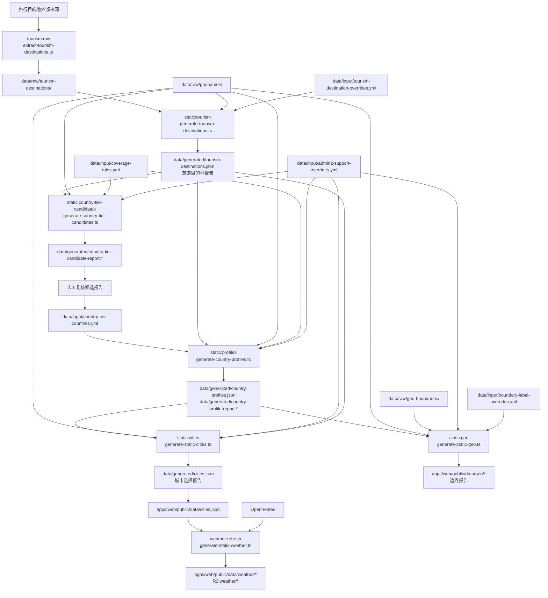

# 数据目录

`data` 保存离线数据链路里的来源快照、人工输入和生成产物。运行时公开页面读取 `apps/web/public/data/*` 和天气包；这里的文件主要给生成脚本和人工复核使用。

```text
data/
├── raw/                 # 外部来源快照，保留原始字段和抓取结果
│   ├── geonames/        # GeoNames 城市、国家、admin1、admin2、别名数据
│   ├── geo-boundaries/  # Natural Earth、geoBoundaries、DataV 边界文件
│   └── tourism-destinations/
│                       # 旅行目的地来源原始数据
├── input/               # 人工可读、可修改的 YAML 输入
└── generated/           # 脚本生成的 JSON、GeoJSON 参考产物和 Markdown 报告
```

`raw` 不做人工整理；`input` 是人工判断的真源；`generated` 不手工修改。需要调整 C2/C3、人口兜底、旅游目的地、边界补名或 admin2 过滤时，先看 `data/generated/*.md` 报告，再修改 `data/input/*.yml`，最后重新运行生成脚本。

## 生成流程



## 运行入口

| 命令 | 处理 | 输出 |
| --- | --- | --- |
| `npm run tourism:raw` | 从旅行目的地外部来源抽取 raw 数据 | `data/raw/tourism-destinations/` |
| `npm run static:tourism` | 混合 raw 旅行快照、旅游目的地 input 和 GeoNames | `data/generated/tourism-destinations.json`、`data/generated/tourism-destination-report.*` |
| `npm run static:country-tier-candidates` | 根据 GeoNames、国家分档规则、旅游目的地和 admin2 input 生成 C2/C3 候选复核表 | `data/generated/country-admin-stats.json`、`data/generated/country-tier-candidate-report.*` |
| `npm run static:profiles` | 读取人工确认的 C2/C3 input，生成最终国家分档 | `data/generated/country-profiles.json`、`data/generated/country-profile-report.*` |
| `npm run static:cities` | 根据国家分档、旅游目的地、admin2 input 和 GeoNames 生成城市列表 | `data/generated/cities.json`、`data/generated/city-selection-report.*`、`apps/web/public/data/cities.json` |
| `npm run static:geo` | 根据边界 raw、国家分档、边界补名 input、admin2 input 和 GeoNames 生成地图边界 | `apps/web/public/data/geo/*`、`data/generated/geo-boundary-report.*` |
| `npm run static:data` | 依次运行城市列表和地图边界生成 | 城市列表、国家分档、地图边界和对应报告 |
| `npm run weather:refresh -- --source=open-meteo` | 根据公开城市列表请求 Open-Meteo 天气 | `apps/web/public/data/weather/*`；CI 生成 R2 上传目录 |
