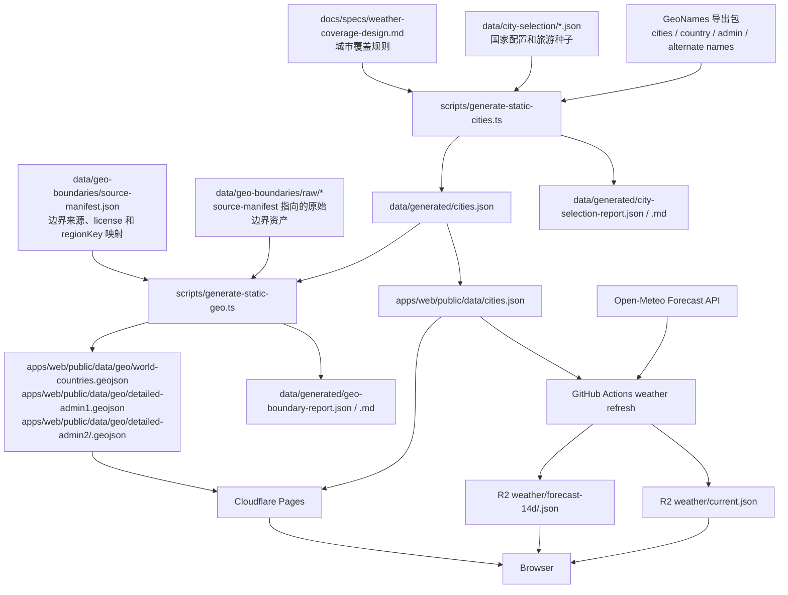

# Cloudflare Data Plan

Weather Trip 免费版使用 Cloudflare Pages + R2 + GitHub Actions 承载公开页面、城市索引、天气包和地图边界。城市选择、国家分档、区域聚合和地图着色规则以 `docs/specs/weather-coverage-design.md` 为真源。

按 5,000 个以内的旅行天气点设计容量。城市数量由覆盖规则和旅游种子共同生成，不作为固定配额；只要仍在 5,000 个以内，文件拆分和刷新方式不需要变化。用户请求不连接 Postgres，不调用 Worker API，不通过 Pages Functions 代理公开 JSON。

## 方案边界

```text
GeoNames / city-selection JSON / 旅游种子
  -> scripts/generate-static-cities.ts
  -> data/generated/cities.json
  -> data/generated/city-selection-report.*

Astro static build
  -> Cloudflare Pages
  -> HTML / CSS / JS / cities.json / GeoJSON 边界

GitHub Actions
  -> 每天读取 cities.json
  -> 按批次调用 Open-Meteo
  -> 生成 weather/forecast-14d/<date>.json
  -> 上传 Cloudflare R2
  -> 校验通过后更新 weather/current.json

浏览器
  -> 读取 /data/cities.json
  -> 读取 R2 weather/current.json
  -> 读取 R2 weather/forecast-14d/<date>.json
  -> 按需读取 GeoJSON 边界
  -> 本地完成地图、筛选、排序和城市详情展示
```

| 能力 | 做法 | 原因 |
| --- | --- | --- |
| 网页入口 | Cloudflare Pages | Astro Web 的页面入口、预览部署、回滚和自定义域名由 Pages 处理 |
| 天气数据对象 | Cloudflare R2 Standard storage | 每日变化的公开 JSON 适合对象存储；额度包含 10 GB-month 存储、Class A 100 万次/月、Class B 1000 万次/月和公网 egress |
| 刷新计算 | GitHub Actions | Open-Meteo 批量刷新会产生外部请求、重试和校验，放在 CI 更稳 |
| 请求时 API | 不使用 Pages Functions / Workers | 公开数据不需要请求时计算；Pages Functions 请求计入 Workers 额度 |
| 运行时数据库 | 无 | 数据是公开快照，前端可以本地查询；数据库会增加运行时路径和迁移成本 |
| R2 上传凭据 | bucket-scoped S3-compatible Object Read & Write token | CI 只需要写入目标 bucket，不持有账号级 Cloudflare API Token |

Cloudflare 额度以官方文档为准。2026-07-23 核对值：Pages 支持 500 builds/月、20,000 files/site、单文件 25 MiB；Pages Functions 请求计入 Workers；Workers 是 100,000 requests/day、50 subrequests/request；R2 是 10 GB-month、Class A 100 万次/月、Class B 1000 万次/月。执行部署前重新核对 Cloudflare Pages limits、Pages Functions pricing、Workers limits 和 R2 pricing。

## 数据与文件



| 文件 | 类型 | 生成者 | 是否提交 Git | 发布位置 | 用途 |
| --- | --- | --- | --- | --- | --- |
| `docs/specs/weather-coverage-design.md` | 规则文档 | 人工维护 | 是 | 仓库文档 | 城市选择、国家分档、区域聚合和地图着色真源 |
| `data/city-selection/country-profiles.json` | 输入配置 | 人工维护 | 是 | 仓库源码 | 国家 C1/C2/C3、人口兜底、补充配额和旅游权重 |
| `data/city-selection/tourism-destinations.json` | 输入配置 | 人工维护 | 是 | 仓库源码 | 热门旅游目的地、小目的地映射和保留权重 |
| GeoNames 导出包 | 外部输入 | GeoNames | 否 | 本地导入缓存 | 城市、国家、一级区域、二级区域和 alternate names 原始来源 |
| `data/geo-boundaries/source-manifest.json` | 输入配置 | 人工维护 | 是 | 仓库源码 | 记录每个边界文件的数据源、版本、license、原始下载地址和 `regionKey` 映射方式 |
| `data/geo-boundaries/raw/*` | 外部输入 | `source-manifest.json` 记录的边界来源 | 否 | 本地导入缓存 | 国家、一级区域和 C3 二级区域的原始边界资产 |
| `data/generated/cities.json` | 生成产物 | `scripts/generate-static-cities.ts` | 是 | 仓库源码 | 城市列表源码产物，供 review 和 Pages 构建复制 |
| `data/generated/city-selection-report.json` | 生成报告 | `scripts/generate-static-cities.ts` | 是 | 仓库源码 | 覆盖缺口、弱代表点、旅游种子未命中和边界未匹配报告 |
| `data/generated/city-selection-report.md` | 生成报告 | `scripts/generate-static-cities.ts` | 是 | 仓库源码 | 便于人工 review 的城市选择摘要 |
| `data/generated/geo-boundary-report.json` | 生成报告 | `scripts/generate-static-geo.ts` | 是 | 仓库源码 | 边界来源、匹配率、未匹配 `regionKey`、简化前后尺寸和 feature 数 |
| `data/generated/geo-boundary-report.md` | 生成报告 | `scripts/generate-static-geo.ts` | 是 | 仓库源码 | 便于人工 review 的边界摘要 |
| `apps/web/public/data/cities.json` | 公开数据 | Pages 构建复制 | 是或构建产物 | Cloudflare Pages | 浏览器读取的城市主索引 |
| `apps/web/public/data/geo/world-countries.geojson` | 公开数据 | `scripts/generate-static-geo.ts` | 是 | Cloudflare Pages | 国家面边界 |
| `apps/web/public/data/geo/detailed-admin1.geojson` | 公开数据 | `scripts/generate-static-geo.ts` | 是 | Cloudflare Pages | 全球一级区域边界 |
| `apps/web/public/data/geo/detailed-admin2/<country>.geojson` | 公开数据 | `scripts/generate-static-geo.ts` | 是 | Cloudflare Pages 或 R2 | C3 国家二级区域边界，按国家懒加载 |
| `apps/web/public/data/weather/current.json` | 本地公开数据 | 天气刷新脚本 | 否 | 本地 dev server | 本地开发使用的活跃天气入口 |
| `apps/web/public/data/weather/forecast-14d/local.json` | 本地公开数据 | 天气刷新脚本 | 否 | 本地 dev server | 本地开发使用的 14 天预报包 |
| `weather/current.json` | 公开数据 | GitHub Actions | 否 | Cloudflare R2 | 生产活跃天气入口，指向一个 forecast 文件 |
| `weather/forecast-14d/<date>.json` | 公开数据 | GitHub Actions | 否 | Cloudflare R2 | 生产 14 天预报包 |

## 公共契约

传输 JSON 类型统一使用 `Wire` 后缀，例如 `CitiesPayloadWire`、`WeatherForecast14dWire`。`Wire` 指 on the wire，也就是跨网络边界传输和存储在 Pages / R2 上的紧凑格式；没有 `Wire` 后缀的类型就是 fetch 后解码得到的应用模型，源码里的筛选、地图聚合、评分和 UI 只使用完整字段名。

`v` 是数据批次版本，用来做缓存识别、问题排查和新鲜度判断，不参与城市和天气的关联。城市与天气只通过 `cityId` 关联。`cv` 表示天气包生成时读取的城市列表版本；如果 `cv` 和浏览器已加载的 `cities.json` 版本不一致，前端仍按 `cityId` 展示能匹配到的天气，新增城市显示暂无天气，过期天气行被忽略。

短字段、数组行和整数化单位只属于 `Wire` 格式。生成脚本输出压缩 JSON，前端 fetch 后立即 decode 成完整应用类型；React 组件、地图聚合、City Finder 筛选和评分逻辑都使用完整字段名，不直接访问 `c[7]`、`d.a1` 或 `row[2]` 这类位置字段。

## 城市数据

城市列表由离线生成器产出：

```text
scripts/generate-static-cities.ts
  -> 下载或读取 GeoNames cities1000.zip、countryInfo.txt、admin1CodesASCII.txt、admin2Codes.txt、alternateNamesV2.zip
  -> 读取 data/city-selection/*.json
  -> 按 docs/specs/weather-coverage-design.md 计算 C1 / C2 / C3 天气点
  -> 输出 data/generated/cities.json
  -> 输出 city-selection-report.json / .md
```

选择规则沿用覆盖设计文档：

| 规则来源 | 用途 |
| --- | --- |
| C1/C2/C3 国家分档 | 决定国家、一级区域或二级区域覆盖深度 |
| 旅游目的地种子 | 保留明确有旅行价值的城市、岛屿、山地门户和小目的地映射 |
| `feature:PPLC` | 保留首都 |
| 人口 fallback | 为每个国家保留人口代表城市 |
| C2 admin1 representative | C2 / C3 国家每个一级区域至少一个代表天气点 |
| C3 admin2 representative | C3 国家每个二级区域至少一个代表天气点 |
| `selectionRank` | 控制默认排序和热门城市优先展示 |

`data/city-selection/country-profiles.json` 使用覆盖设计文档的 C1/C2/C3 语义，例如 `coverageTier: 'C1' | 'C2' | 'C3'`，并保留人口兜底、补充配额和旅游权重。

`cities.json` 只保存公开前端需要的字段，不保存 GeoNames 原始大字段、全量别名、历史名称、内部导入状态或数据库排查字段。C3 国家页和二级区域着色需要稳定的 `admin2`，但 JSON 里不同时保存 `regionKey` 和它的组成字段；`country:${code}`、`admin1:${country}.${admin1}`、`admin2:${country}.${admin1}.${admin2}` 在前端由字典行生成。

```ts
interface CitiesPayloadWire {
  v: string; // 城市列表版本，例如 cities-2026-07-23
  d: CitiesDictWire; // 字典，给城市行复用
  c: CityRowWire[]; // 城市行，顺序就是默认排序
}

interface CitiesDictWire {
  co: CountryRowWire[]; // 国家字典
  a1: Admin1RowWire[]; // 一级区域字典
  a2: Admin2RowWire[]; // 二级区域字典
}

type LocalizedNameWire = [en: string, zh: string];
type WorldRegionCode = 'asia' | 'europe' | 'north_america' | 'south_america' | 'africa' | 'oceania';
type CoverageTierCode = 1 | 2 | 3; // C1 / C2 / C3
type CountryRowWire = [code: string, name: LocalizedNameWire, worldRegion: WorldRegionCode, coverageTier: CoverageTierCode];
type Admin1RowWire = [countryIndex: number, code: string, name: LocalizedNameWire];
type Admin2RowWire = [countryIndex: number, admin1Index: number, code: string, name: LocalizedNameWire];

type CityRowWire = [
  id: string, // 稳定城市 ID，例如 geonames-1853909
  name: LocalizedNameWire, // 城市中英文名，只在 cities.json 保存
  countryIndex: number,
  admin1Index: number | null,
  admin2Index: number | null,
  latE5: number, // latitude * 100000 后取整
  lngE5: number, // longitude * 100000 后取整
  elevationM: number // 城市主索引海拔，来自 GeoNames 或种子补全
];
```

城市 JSON 使用短字段名和数组行是为了减小传输体积，并让 gzip / Brotli 更容易压缩。重复值放进 `d` 字典：国家、一级区域和二级区域都用下标引用。城市自己的中英文名只出现一次；天气包不保存城市名、国家名、行政区名和坐标。

`cities.c` 的顺序就是默认排序。这个顺序只用于解码时派生 `rank` 和组件渲染时的数组位置，不作为字段保存到业务类型里。稳定身份始终是 `id`；天气、URL、收藏、埋点、本地缓存和跨版本引用都保存 `id`，不保存数组下标。只要城市集合、顺序或字段变化，就必须生成新的 `v`。

`selectionReasons` 不进入公开城市 JSON。它服务导入审计、覆盖复盘和调试，保存在 `city-selection-report.json` / `.md`；前端展示控制使用 coverage tier、region key、rank 和后续明确新增的公开字段，不复用审计原因。

`coverageTier` 放在国家字典里，不在每个城市行重复。`rank` 不传输，`cities.c` 的顺序就是排序真源，解码后用数组位置 + 1 作为 rank。`geonameId`、`timezone`、`population`、城市列表生成时间和覆盖摘要也不进入公开城市 JSON。`geonameId` 用于追溯，放在生成报告；`timezone` 只影响天气源返回的当地日期，天气包已经保存 date-only 结果；排序和 marker prominence 使用解码后的 rank；城市数量和覆盖统计由 `c.length`、字典和报告计算。

`countryIndex`、`admin1Index` 和 `admin2Index` 在前端展开成展示对象和区域 key。GeoJSON 仍使用 `properties.regionKey`；城市侧由字典行生成同样的 key 后匹配。

```ts
interface CitiesPayload {
  version: string;
  cityCount: number;
  cities: City[];
}

interface City {
  id: string;
  name: { en: string; zh: string };
  country: {
    code: string;
    regionKey: string; // country:CN
    name: { en: string; zh: string };
    worldRegion: WorldRegionCode;
  };
  admin1?: {
    code: string;
    regionKey: string; // admin1:CN.25
    name: { en: string; zh: string };
  };
  admin2?: {
    code: string;
    regionKey: string; // admin2:CN.25.04
    name: { en: string; zh: string };
  };
  coverageTier: 'C1' | 'C2' | 'C3';
  latitude: number;
  longitude: number;
  elevationM: number;
  worldRegion: WorldRegionCode;
  rank: number;
}
```

生成城市列表时同步输出报告，用于 review 覆盖质量。

```ts
type CitySelectionReport = {
  version: string;
  generatedAt: string;
  cityCount: number;
  byCoverageTier: Record<CoverageTier, number>;
  byCountry: CitySelectionCountryReport[];
  missingAdmin1Representatives: RegionGap[];
  missingAdmin2Representatives: RegionGap[];
  weakRepresentatives: RegionWeakRepresentative[];
  unmatchedTourismSeeds: TourismSeedGap[];
  unmatchedGeoBoundaries: RegionGap[];
};
```

报告需要检查 C2/C3 代表点覆盖、中国地级行政区口径、小目的地处理结果、`regionKey` 边界匹配、弱代表点和名称明显异常的城市。

## 天气数据

未来 14 天全量天气放在一个紧凑 JSON 里。City Finder 需要跨 3 / 5 / 7 / 10 / 14 天筛选，如果按日期拆分，前端反而要请求多个文件并处理部分日期失败。

```ts
interface WeatherCurrentWire {
  v: string; // 每日天气版本，例如 2026-07-23
  g: string; // 生成时间，ISO 字符串
  dd: string; // UI 默认地图日期
  ds: string[]; // 14 天预报窗口里的 date-only key
  cv: string; // 对应 cities.json 的 v
  f: string; // weather/forecast-14d/<date>.json 路径
}

interface WeatherForecast14dWire {
  v: string; // 每日天气版本，必须等于 current.v
  cv: string; // 对应 cities.json 的 v
  w: CityWeatherRowWire[];
}

type CityWeatherRowWire = [
  cityId: string,
  sourceElevationM: number | null, // 天气接口本次响应返回的 elevation
  days: Array<DayWeatherRowWire | null> // 下标等于 current.ds 的 dateIndex
];

type DayWeatherRowWire = [
  weatherCode: number,
  temperatureMinC: number,
  temperatureMaxC: number,
  temperatureMeanC: number,
  humidityMeanPercent: number,
  precipitationSumMm: number,
  windSpeedMaxKmh: number | null
];
```

天气包用 `cityId` 关联城市，不用数组下标做跨文件外键。前端读取后按 `cityId` 建立 `forecastByCityId`；`current.cv` 和 `forecast.cv` 用来判断天气包对应哪个城市列表版本，并用于展示数据新鲜度或上报异常，不阻止已匹配城市展示。城市列表新增而天气还没刷新时，该城市显示暂无天气；天气包里已经不存在于已加载 `cities.json` 的城市行直接忽略。每个城市内的日期数组按 `current.ds` 对齐，缺某天时用 `null` 占位，不写 `dateIndex`。

Open-Meteo Forecast API 在响应顶层返回 `elevation`，并说明这个值用于 statistical downscaling；它不是 `daily` 数组里的逐日变量，但属于天气源本次 forecast 的点位元数据。刷新任务要把它保存为 `sourceElevationM`。地图的 elevation layer 优先使用 `sourceElevationM`，没有时回退到 `cities.json` 的 `elevationM`。如果后续天气源返回真正逐日变化的海拔或类似地形字段，再把它加入 `DayWeatherRowWire`。

`weatherType` 和 `comfortScore` 不写入天气包，由前端通过 `weatherCode` 和共享公式计算。`precipitationProbabilityMax` 不进入首版传输字段；页面用 `precipitationSumMm` 表达降水，后续如果明确展示降水概率再加回。单位固定为摄氏度、毫米、公里/小时和百分比，不在每条记录里重复写单位。

```ts
interface WeatherWindow {
  version: string;
  generatedAt: string;
  cityListVersion: string;
  dates: string[];
  sourceByCityId: Map<string, WeatherSourceMeta>;
  forecastsByCityId: Map<string, DailyForecast[]>;
}

interface WeatherSourceMeta {
  elevationM: number | null;
}

interface DailyForecast {
  date: string;
  dateIndex: number;
  weatherCode: number;
  weatherType: 'sunny' | 'partly_cloudy' | 'cloudy' | 'overcast' | 'fog' | 'light_rain' | 'rain' | 'thunderstorm' | 'light_snow' | 'snow';
  temperatureMinC: number;
  temperatureMaxC: number;
  temperatureMeanC: number;
  humidityMeanPercent: number;
  precipitationSumMm: number;
  windSpeedMaxKmh: number | null;
}
```

`dates` 使用 Open-Meteo `timezone=auto` 返回的地点当地自然日，不是 UTC 时间戳。生成、比较和校验日期时使用 date-only 字符串，不能把城市当地日期转成 `toISOString()` 后再截取日期。`defaultDate` 只是 UI 默认日期；跨时区城市可能在窗口头尾有自然日差异，校验时按每个城市自己的 14 条 daily 结果判断。

Open-Meteo Forecast API 支持最多 16 天预报；本项目使用未来 14 天。Open-Meteo public API 适合评估和原型，限制包括 600 calls/min、5,000 calls/hour、10,000 calls/day、300,000 calls/month，且不提供商业使用许可和 uptime guarantee。项目商业化或流量明显增加时，需要评估 Open-Meteo customer API 或替代天气源。

按 5,000 个以内城市估算。batch size 40 时，每日完整刷新最多约 125 个 HTTP 请求；如果实际城市数是 3,600 个左右，则约 90 个请求。生成器要限制并发、实现重试和失败摘要，不把失败半成品发布到 `weather/current.json`。

刷新流程：

```text
1. 读取 Pages 发布的 cities.json
2. 校验城市字段契约
3. 按 batch size 调 Open-Meteo Forecast API
4. 生成 weather/forecast-14d/<date>.json
5. 上传 forecast JSON 到 R2
6. 下载回读并校验 `cv`、`ds`、每个 `cityId`、`sourceElevationM`、字段范围和 JSON 可解析性
7. 校验通过后更新 weather/current.json
8. 校验失败时保留原 current，并输出 CI 失败摘要
```

## 地图边界

代表点进入 `cities.json` 只解决天气数据。地图按国家、一级区域和二级区域着色还需要 GeoJSON 边界。

```ts
type GeoFeaturePropertiesWire = {
  regionKey: string; // country:CN / admin1:CN.25 / admin2:CN.25.04
  countryCode: string;
  admin1Code?: string;
  admin2Code?: string;
  name: string;
  nameZh: string;
};

type RegionGeoFeatureProperties = {
  regionKey: string;
  countryCode: string;
  admin1Code?: string;
  admin2Code?: string;
  name: string;
  nameZh?: string;
};
```

| 图层 | 文件 | 读取时机 | 匹配方式 |
| --- | --- | --- | --- |
| 国家面 | `/data/geo/world-countries.geojson` | Weather Map 首次进入国家层时读取 | `properties.regionKey = country:<countryCode>` |
| 一级区域面 | `/data/geo/detailed-admin1.geojson` | 全球/大洲概览和 C2/C3 国家详情读取 | `properties.regionKey = admin1:<countryCode>.<admin1Code>`，前端归一化为分区 key |
| C3 二级区域面 | `/data/geo/detailed-admin2/<country>.geojson` | 进入对应 C3 国家详情后懒加载 | `properties.regionKey = admin2:<countryCode>.<admin1Code>.<admin2Code>` |
| 城市点 | `/data/cities.json` | Weather Map 和 City Finder 共用 | 解码城市字典后生成同一套 region key |

边界文件必须按 `regionKey` 匹配城市聚合结果。无法匹配的区域不着色，并写入 `city-selection-report` 或边界生成报告。城市点和区域着色使用同一批天气点。区域颜色来自天气点聚合，不使用行政区几何面积平均，也不做邻近插值；tooltip 展示样本数、代表天气点和聚合方式。

中国边界源如果使用 adcode，映射只发生在 `scripts/generate-static-geo.ts` 内部。发布到 `/data/geo/detailed-admin2/CN.geojson` 的 feature 仍使用统一的 `GeoFeaturePropertiesWire`，不把 adcode 作为前端匹配字段。

`data/geo-boundaries/source-manifest.json` 是边界来源清单，不是前端入口。每条记录必须包含原始来源名称、版本或发布日期、license、原始下载 URL 或本地 raw path、输出文件、目标层级和 key 映射方式。没有来源和 license 的边界文件不能新增或重生成。

## 前端读取

前端进入 Weather Map 或 City Finder 后加载同一批核心数据。

```text
打开工具页
  -> 读取 /data/cities.json
  -> 读取 R2 weather/current.json
  -> 读取 current.f
  -> 按 cityId 匹配天气，忽略已加载 cities.json 不存在的天气行
  -> 建立 cityById、weatherByCityId、dateIndex、region indexes
```

Weather Map：

```text
World = 全部支持城市
切 region = 基于 cities.json 的 country/admin1/admin2 key 本地过滤
切 date = 从 weather/forecast-14d/<date>.json 取 dateIndex
切 layer = 换展示字段，不请求新天气数据
选中城市 = 用 cityId 从 weather/forecast-14d/<date>.json 取 14 天数组
切国家详情 = 按 coverageTier 加载 admin1 或 admin2 边界
```

City Finder：

```text
搜索 = 基于 cities.json 本地搜索
天气筛选 = 基于 weather/forecast-14d/<date>.json 本地计算 matchDays / score / bestStreakDays
地区筛选 = 基于 cities.json 的 region key 本地过滤
结果列表 = 前端排序后分页展示
```

## 文件预算

估算口径是 5,000 个以内城市、14 天预报窗口、国家/一级区域边界，以及覆盖设计要求的 C3 二级区域边界。尺寸指生产 minified JSON / GeoJSON；仓库已有的国家和一级区域 GeoJSON 使用实测尺寸，城市、天气和 C3 二级边界使用目标 `Wire` 字段与简化后 GeoJSON 估算。

| 文件 | 用途 | 何时读取 | 数量 | 原始尺寸 | gzip | Brotli |
| --- | --- | --- | ---: | ---: | ---: | ---: |
| `/data/cities.json` | 城市主索引；保存城市 ID、中英文名、坐标、海拔、国家/一级/二级区域字典和默认排序 | Weather Map 和 City Finder 都会读取；前端用它做搜索、地区筛选、marker 定位和天气 `cityId` 匹配 | 1 | 0.8-1.4 MiB | 250-500 KiB | 180-380 KiB |
| `weather/current.json` | 活跃天气入口；保存天气版本、生成时间、日期窗口、默认日期和 forecast 文件路径 | 进入工具页后读取；短缓存，用来发现天气是否更新 | 1 | < 2 KiB | < 1 KiB | < 1 KiB |
| `weather/forecast-14d/<date>.json` | 14 天预报包；保存每个 `cityId` 的天气源海拔，以及每日天气码、温度、湿度、降水和风速 | 读取 current 后加载；City Finder 用它筛选天气，Weather Map 用它按日期和图层着色 | 1 个活跃 forecast | 2.9-4.3 MiB | 820 KiB-1.45 MiB | 650 KiB-1.2 MiB |
| `/data/geo/world-countries.geojson` | 国家面边界；用于全球/大洲地图的国家轮廓、C1 国家着色和进入国家详情 | Weather Map 首次进入国家层时读取 | 1 | 222,833 B | 78,402 B | 55,123 B |
| `/data/geo/detailed-admin1.geojson` | 全球一级区域边界；用于详细国家在全球/大洲视图下展示内部天气差异，也用于 C2 国家详情 | Weather Map 首次进入分区层时读取，是固定公开文件里的最大文件 | 1 | 5,875,649 B | 1,767,617 B | 1,060,688 B |
| `/data/geo/detailed-admin2/<country>.geojson` | C3 国家二级区域边界；用于中国、西班牙、法国等国家详情里的细粒度区域着色 | 进入对应 C3 国家详情时懒加载；不进入全球首屏 | 12 | 单文件 300 KiB-6 MiB | 单文件 100 KiB-1.8 MiB | 单文件 80 KiB-1.4 MiB |

一个活跃快照约 17 个公开数据文件：Pages 侧 15 个，R2 侧 2 个。R2 如果保留 30 天历史预报包，会额外增加 30 个 `weather/forecast-14d/<date>.json`，但用户默认只读取 `weather/current.json` 指向的一个 forecast 文件。

City Finder 只需要 `cities.json`、`weather/current.json` 和 `weather/forecast-14d/<date>.json`，压缩后约 1.1-1.9 MiB。Weather Map 全球视图再加国家面和一级区域面，压缩后约 2.0-4.3 MiB；进入 C3 国家详情时再懒加载一个二级区域文件。

| 文件 | 上限 |
| --- | ---: |
| `weather/forecast-14d/<date>.json` | 原始尺寸 < 5 MiB，压缩尺寸 < 1.5 MiB |
| `cities.json` | 原始尺寸 < 1.5 MiB，压缩尺寸 < 500 KiB |
| 任一 GeoJSON | 原始尺寸 < 8 MiB，压缩尺寸 < 2 MiB |
| Pages 单文件硬边界 | 25 MiB |

如果任一 GeoJSON 接近 8 MiB，先降低坐标精度、提高 simplify tolerance 或按国家拆包；如果 `weather/forecast-14d/<date>.json` 接近 5 MiB，先评估字段裁剪、整数化单位和 Web Worker 解析，不直接改成请求时数据库查询。

## 拆分与缓存

| 维度 | 做法 | 原因 |
| --- | --- | --- |
| 城市 | 全部城市放入 `cities.json` | 5,000 个以内城市仍适合本地搜索和筛选 |
| 城市字段 | 白名单 compact 字段 | 避免提交 GeoNames 原始大字段和内部字段 |
| 天气 | 14 天合并为 `weather/forecast-14d/<date>.json` | City Finder 需要完整窗口，本地筛选最简单 |
| 日期 | 不拆 | 切日期无需请求，减少状态复杂度 |
| 图层 | 不拆天气 | 图层只是 UI 展示字段，不是天气存储维度 |
| 地区 | 不拆天气 | World 展示全部城市，国家/大区由前端过滤 |
| 地图边界 | 按层级和 C3 国家拆 | GeoJSON 是主要体积风险，按需加载 |
| 搜索索引 | 先不单独拆 | 城市数不大；移动端卡顿后再生成轻量 search index |

当 `weather/forecast-14d/<date>.json` 下载、解析或筛选影响移动端体验时，先引入 Web Worker 或按地区生成搜索/筛选索引；不要直接把请求时数据库查询作为第一选择。

| 文件 | 缓存 |
| --- | --- |
| `/data/cities.json` | 随 Pages 发布，可长缓存；文件名或构建 hash 变化时更新 |
| `weather/current.json` | 短缓存，5-15 分钟，或使用 ETag |
| `weather/forecast-14d/<date>.json` | 长缓存，`public, max-age=31536000, immutable` |
| `geo/*.geojson` | 随 Pages 发布，可长缓存；文件名或构建 hash 变化时更新 |

每天 GitHub Actions 只上传新的 forecast 文件，并在校验通过后更新 `weather/current.json` 指向新文件。

## 本地开发

本地开发不依赖公网 R2。生成脚本支持把天气包写入 `apps/web/public/data/weather/forecast-14d/local.json`，并生成本地 `weather/current.json`。

```text
apps/web/public/data/
├── cities.json
└── weather/
    ├── current.json
    └── forecast-14d/
        └── local.json
```

前端数据 base URL 由环境变量或构建配置决定：

```text
PUBLIC_STATIC_DATA_BASE_URL=/data
PUBLIC_R2_DATA_BASE_URL=https://static.weather-trip.example.com
```

真实 R2 bucket 名、account id、access key 和 secret 写入 GitHub Actions secrets 或部署平台配置，不提交到仓库。

## 扩展条件

| 条件 | 动作 |
| --- | --- |
| 城市数接近 10,000 | 评估 `weather/forecast-14d/<date>.json` 下载、解析和筛选耗时 |
| City Finder 在移动端筛选卡顿 | 引入 Web Worker、轻量搜索索引或按地区懒加载 |
| GeoJSON 文件接近 Pages 单文件限制或地图首屏慢 | 简化边界、按国家拆包，必要时放 R2 |
| R2 Class B 读请求接近额度 | 增加 Cloudflare Cache、合并请求、调整缓存和热门路径预取 |
| Open-Meteo public API 不符合用途或 SLA | 评估 Open-Meteo customer API、商业许可或替代天气源 |
| 需要用户收藏、个性化、权限或保存筛选 | 引入后端 API 和数据库 |
| 城市数达到 40,000+ 或需要复杂服务端查询 | 按 Pro 版方案评估数据库查询 |

## 落地检查

| 检查项 | 标准 |
| --- | --- |
| 覆盖规则 | `free-static-data-plan.md` 没有定义与 `docs/specs/weather-coverage-design.md` 冲突的城市选择规则 |
| 城市字段 | `cities.json` 包含 C1/C2/C3、country/admin1/admin2，并能生成稳定 `regionKey` |
| 报告 | 城市生成同步输出覆盖缺口、弱代表点、旅游种子未命中和边界未匹配 |
| 天气刷新 | CI 失败不更新 `weather/current.json` |
| 日期语义 | 天气日期按地点当地自然日处理，不做 UTC 日期截断 |
| 前端读取 | 用户请求不经过 Pages Functions / Workers 代理 JSON |
| 缓存 | current 短缓存，forecast 和边界长缓存 |
| 尺寸报告 | 构建或生成脚本输出每个公开 JSON / GeoJSON 的原始尺寸和压缩尺寸，并检查是否超过预算 |
| Pages 发布 | 提供顶层 `404.html`，缺失 asset 返回 404，不回落首页 HTML |
| 线上验证 | 首页、CSS、JS、`/data/*.json`、R2 current、forecast 和 GeoJSON MIME type 正确 |

## 官方参考

- Cloudflare Pages limits: <https://developers.cloudflare.com/pages/platform/limits/>
- Cloudflare Pages Functions pricing: <https://developers.cloudflare.com/pages/functions/pricing/>
- Cloudflare Workers limits: <https://developers.cloudflare.com/workers/platform/limits/>
- Cloudflare R2 pricing: <https://developers.cloudflare.com/r2/pricing/>
- Open-Meteo pricing: <https://open-meteo.com/en/pricing>
- Open-Meteo Forecast API: <https://open-meteo.com/en/docs>
