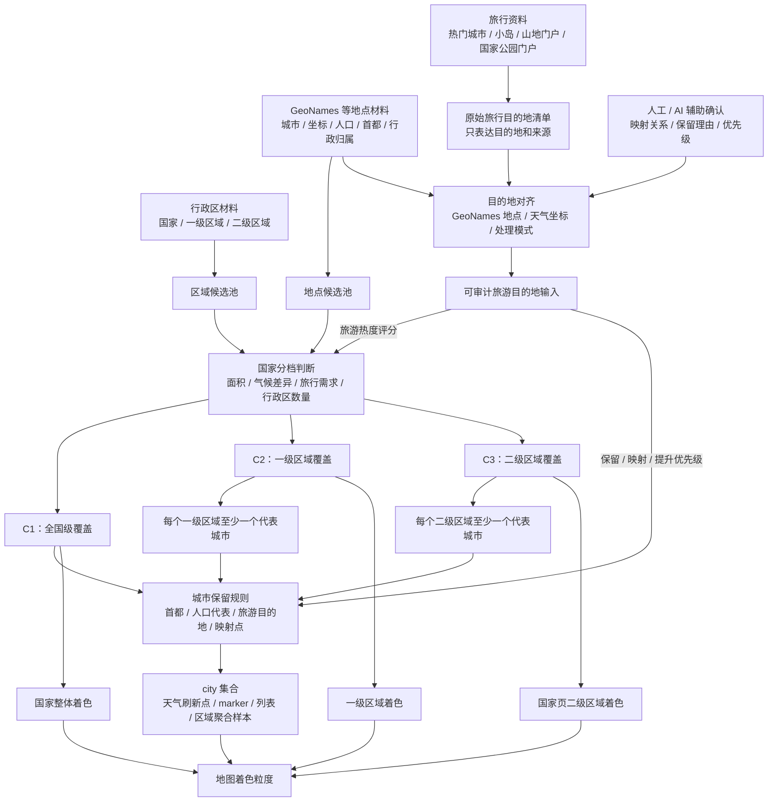

# 天气覆盖设计：国家分层、城市选择与地图着色

## 目标

Weather Trip 的核心任务是让用户比较旅行目的地天气。这个目标拆成两件事：

| 对象         | 作用                                                              |
| ------------ | ----------------------------------------------------------------- |
| 城市（city） | 决定哪些城市或代表地点每天刷新天气，并参与列表、marker 和区域聚合 |
| 地图着色面积 | 决定天气颜色落在国家、一级区域还是二级区域上                      |

外部地点和行政区全集不适合直接变成产品展示全集。天气覆盖要先决定国家分层深度，再决定每个层级需要哪些代表城市。

全量支持会带来天气刷新、缓存、地图渲染和移动端交互的性能问题。即使只给每个二级行政区抽一个城市，也会接近 5 万个城市，远超过产品需要。

很多二级区域对旅行天气比较的边际价值也不高。天气覆盖要保留足够的空间差异，同时把城市数量、区域聚合和地图渲染控制在稳定范围内。

## 基础概念

| 概念        | 含义                                                                                                                                   |
| ----------- | -------------------------------------------------------------------------------------------------------------------------------------- |
| 城市 / city | 系统每天刷新天气并在页面展示的城市或代表地点。大多数记录是城市；少数记录可能是县镇、岛屿、景区门户、行政代表点或手工补充的旅行代表地点 |
| 区域        | 地图上被着色的面，可以是国家、一级区域（例如省、州、大区）或二级区域（例如地级市、郡、县级市镇）                                       |
| 三档国家    | 国家按覆盖深度分为 C1、C2、C3                                                                                                          |
| 两档体验    | 产品按全球/大洲和国家两种地图工作区组织                                                                                                |

项目不会把外部地点全集当作产品展示全集；真正每天刷新天气并展示给用户的是筛选后的 `city` 集合。

本文负责定义覆盖策略、国家分层、城市选择和地图着色规则。来源、生成链路和产物见 `docs/specs/31-data-flow.md`；公开数据分块和前端请求方式见 `docs/specs/32-public-data-contract.md`。

## 覆盖决策流程

Coverage 决策从原始材料进入候选池开始，但这里描述的是设计链路，不是执行流程。原始地点、行政区和旅游资料先变成可审计输入，再由国家分档规则决定每个国家的覆盖深度、城市最低覆盖要求和地图着色粒度。

原始旅行目的地清单只回答“哪些地方有旅行价值”，不直接携带天气点位。它和 GeoNames 地点、天气坐标、人工确认的映射关系混合后，才形成可审计旅游目的地输入。这个输入有两种用途：进入国家分档时提供旅行需求权重；进入城市选择时决定目的地应独立保留、映射到附近城市，还是提高已有城市成为代表点的优先级。具体文件、生成链路、报告产物和公开 JSON 契约见 `docs/specs/31-data-flow.md` 和 `docs/specs/32-public-data-contract.md`。

## 覆盖原则

Coverage 不能假设城市、天气和行政边界天然对齐，也不能因为其中一类数据缺失，就让另一类已经可用的数据消失。

| 对象               | 在 coverage 里的职责                              |
| ------------------ | ------------------------------------------------- |
| 城市 / city        | 决定卡片、marker、搜索和区域聚合样本              |
| 点位天气           | 给城市提供天气指标，供列表、marker 和区域聚合使用 |
| 行政区域面         | 决定地图上可以展示、hover、点击和着色的区域       |
| 地图底图和天气瓦片 | 只提供视觉上下文，不参与 coverage 判断            |

行政区域面能显示时，就应该直接显示区域边界；点位天气能刷新城市天气时，就应该直接显示卡片和 marker；两者对齐成功时，区域获得指标色和天气摘要；没有对齐或没有天气样本时，区域仍保留边界、名称和 hover，只显示无数据样式。

因此卡片范围、marker 范围和区域着色范围是三个独立层：卡片和 marker 来自城市，区域面来自行政边界，区域颜色来自城市与区域匹配后的聚合结果。这个分离让用户可以看到完整地理区块，也能看清哪些区块有天气样本、哪些区块暂时没有数据。

## 三档国家

国家分层深度分为三档。`C` 表示 country，数字从粗到细排列；C1/C2/C3 只是 country tier 代码，不代表国家重要性排序。

| 档位 | 名称       | 覆盖含义                                                   |
| ---- | ---------- | ---------------------------------------------------------- |
| C1   | 全国级国家 | 默认档位，不做行政区兜底（不强制每个省州都有城市）         |
| C2   | 省州级国家 | 每个一级区域（省、州、大区这一级）至少需要一个城市         |
| C3   | 地市级国家 | 每个二级区域（地级市、郡、县级市镇这一级）至少需要一个城市 |

C2 和 C3 分别对应标准化后的一级区域和二级区域。不同国家的真实行政区名称不同，所以文档统一用“一级区域”和“二级区域”描述地图与数据层级。

## 两档产品体验

产品体验分为全球/大洲和国家两档。两档都要同时定义城市显示和地图着色。

城市显示由 `city` 集合决定，地图着色由区域面积决定。两者可以不同：同一视图里可以显示所有城市，但区域颜色按更粗的国家或一级区域聚合。

| 体验档位  | 城市显示                                                         | 地图着色                                                |
| --------- | ---------------------------------------------------------------- | ------------------------------------------------------- |
| 全球/大洲 | 使用所选全球或大洲范围内所有`cities` 参与列表、marker 和区域聚合 | C1 国家按国家整体；C2 / C3 国家按一级区域               |
| 国家      | 使用该国家所有`cities` 参与列表、marker 和区域聚合               | C1 国家按国家整体；C2 国家按一级区域；C3 国家按二级区域 |

两档体验都使用范围内全部城市。城市规模按 3,500+ 设计，公开数据包控制在 5,000 个以内；列表、marker 和聚合可以承受。地图 marker 密度交互见 `docs/specs/22-weather-map-interactions.md`。

全球/大洲视图中的一级区域叠加层主要用于概览，不把用户直接带到某个省州筛选。固定大区选择包含六大洲，并额外提供东亚和东南亚这类产品子大区；城市字典里的 `worldRegion` 仍只保存六大洲，子大区由前端匹配国家集合得到。地图边界按缩放使用三档 MVT：`z1-z2` 为国家级，`z3-z4` 为一级区域和国家 fallback，`z5-z8` 为二级区域和上层 fallback。用户通过下拉进入 C2/C3 国家详情，再在国家工作区选择一级区域；C3 二级区域只用于高 zoom 着色、hover 和覆盖复核。

## 国家分档规则

三档国家的分法来自两个判断：国家内部天气差异是否值得展开，以及展开到某一级行政区后数据量是否可控。

不同国家的行政区数量差异很大，统一抽到同一层级会让一些国家过粗，也会让另一些国家过细。中国的二级区域更接近地级行政区，数量约 360；美国的二级区域基本对应 county / county-equivalent（县或类似县的单位），包括 county、parish、borough、census area、independent city 等，全国合计超过 3,000。

| 当前已选类型 | 国家 | 设计判断 |
| --- | --- | --- |
| C3 | CN、ES、FR、IT、PE | 二级区域数量可控，或二级区域语义接近旅行天气区域，国家页下钻有明显价值 |
| C2 | AR、AU、BR、CA、CL、CO、EG、ID、IN、JP、MA、MX、MY、RU、TH、TR、TZ、US、VN、ZA | 面积、纬度/经度跨度、海拔差异或旅行需求强，但二级区域数量过多或语义过细 |

国家层级复核名单是人工复核后的 input，不由脚本按预算自动增减。候选报告负责把候选国家排好序，并列出每个国家升 C2 或 C3 的收益和成本；人工读完报告后，把决定写入 `data/input/country-tier-countries.yml`，再生成 `data/generated/country-profiles.jsonl`。`countryTier: C1` 表示候选已复核但不升档；`reason` 只作为人工复核备注，生成脚本不把它写入 profiles 或报告。

`data/report/country-tier-candidate-report.md` 由 `scripts/generate-country-tier-candidates.ts` 根据 GeoNames、旅游目的地输入、覆盖规则和 admin2 输入生成。候选报告只输出候选命中、分数、升档城市增量、代表点重合、空间/旅行/行政指标和缺口，不输出 C2/C3 理由；字段口径见 `docs/specs/31-data-flow.md`。C3 是比 C2 更细的国家层级，命中 C3 候选的国家也会自动进入 C2 复核队列。人工判断写在 `country-tier-countries.yml` 的 `reason` 备注里，后续生成产物只用 `countryCode` 和 `countryTier`；其中 C1 行不会产生详细区域覆盖。

### C1 国家

C1 是默认档位。没有进入 C2 或 C3 的国家都按 C1 处理。

C1 适合长尾国家、小国、城市国家、岛国和暂不深挖的中等国家。它们可以有多个城市，但没有行政区兜底要求；覆盖重点放在首都、热门城市、人口代表城市和人工确认的旅游目的地。

### C2 国家

C2 适合两类国家：

1. 面积大，内部气候、海拔、纬度或东西跨度会让国家级颜色明显失真
2. 热门旅行国家，但二级区域数量过多或语义过细，国家页按一级区域已经足够

C2 入选来自三组判断：

| 入选类型      | 判断标准                                                                                   |
| ------------- | ------------------------------------------------------------------------------------------ |
| 大面积国家    | 国土面积大，东西或南北跨度明显，国家级颜色会抹平气候和海拔差异                             |
| 热门旅行国家  | 用户会进入国家页比较区域天气，但二级区域数量过多或语义过细                                 |
| C3 不合适国家 | 二级区域达到数百到数千个，或二级区域更像 county / municipality（县、市镇）这类过细行政单元 |

当前已选 C2 国家包括 AR、AU、BR、CA、CL、CO、EG、ID、IN、JP、MA、MX、MY、RU、TH、TR、TZ、US、VN、ZA。它们的共同特征是面积或空间跨度大、旅行需求明显，二级区域数量过多或语义过细，按一级区域已经能表达主要旅行天气差异。候选国家需要先看 `country-tier-candidate-report.md` 的优先级、旅行价值、城市增量和边界成本，再写入 `country-tier-countries.yml`。

### C3 国家

C3 适合二级区域数量可控、且二级区域语义接近旅行天气区域的国家。

C3 只取热门旅行国家、面积较大、二级区域数量可控且边界包尺寸可控的国家。入选来自三组判断：

| 入选类型           | 判断标准                                                             |
| ------------------ | -------------------------------------------------------------------- |
| 二级区域数量可控   | 全国二级区域大致在几十到两百左右；中国约 360 个大陆地级旅行区域并附带港澳台 companion 区块 |
| 二级区域有旅行意义 | 二级区域能表达山地、海岸、岛屿、内陆、高原、城市群等天气差异         |
| 国家页需要明显下钻 | 进入国家页后，二级区域比一级区域提供更有用的天气比较粒度             |

当前已选 C3 国家包括 CN、ES、FR、IT、PE。中国这类地区需要确认大陆二级区域是否接近地级旅行区域，并把港澳台 companion 区块纳入详情图；其他候选国家需要看面积、旅游热度、二级区域数量、城市覆盖率和边界成本。实际城市会和一级区域、人口兜底、旅游目的地城市重合一部分。

C3 国家需要重点检查二级区域的语义质量，避免把不稳定的二级区域直接变成国家页默认体验。如果某国存在类似直辖市、首都特区、大都会区这类“城市天气样本代表范围比下级行政区更粗”的情况，该区域停在可被样本代表的层级；只有确认天气样本和二级边界是一对一或多点聚合关系时，才给二级区块写入天气关联。

工具页的可选子区域只到一级行政区。C3 的二级区域只用于国家详情图的着色、区域聚合和覆盖复核；URL 或保存状态里的二级区域会归一到所属一级行政区。

## 城市选择规则

城市选择从国家分档开始。先决定国家属于 C1/C2/C3，再按对应深度选择城市。

国家分档、人口兜底、旅游权重和目的地映射都应保持可审计。运行时逻辑只使用通用数据读取和区域匹配规则，不按国家或地区写特殊分支。

旅游目的地和最终城市保持分离。旅游目的地描述用户可能关心的地方，城市描述系统实际刷新天气的坐标。

一个目的地可以独立进入 `cities`，也可以映射到附近城市，或只提高已有城市的入选优先级。

| 目的地模式            | 处理                                                       |
| --------------------- | ---------------------------------------------------------- |
| `standalone`          | 尝试作为独立城市进入`cities`，例如远离大陆的海岛           |
| `map_to_nearest_city` | 映射到附近城市，不直接增加城市，例如景区映射到住宿城市     |
| `boost_existing_city` | 提高已有城市入选优先级，例如热门目的地让附近城市更容易入选 |

### 入选理由

| 入选理由       | 作用                                                                                     |
| -------------- | ---------------------------------------------------------------------------------------- |
| 首都           | 保证长尾国家最低可见性                                                                   |
| 人口代表城市   | 保证主要城市天气可比较                                                                   |
| 一级区域代表点 | 保证 C2 / C3 国家在一级区域上有最低样本，例如每个省州至少一个城市                        |
| 二级区域代表点 | 保证 C3 国家在国家详情图有细粒度样本，例如每个地级市至少一个城市                         |
| 旅游目的地     | 保证热门旅行目的地、小岛、山地门户和国家公园门户不被人口规则漏掉                         |
| 映射点         | 将区域、景区、主题公园或小村映射到附近更适合展示的城市，例如把主题公园映射到最近住宿城市 |

只按行政中心（省会、州府、地级市政府所在地这类行政驻地）、人口大城市和每个区域人口前几名全量纳入，会选出大量普通行政中心。这个数量超过天气刷新和前端展示需要，也不等于用户会主动比较天气的旅行目的地。

行政中心身份不作为全量入选理由，只作为排序和候选特征参与评分。

### C1 国家城市选择

C1 国家不按行政区做兜底，只保留少量真正有用的城市：

| 城市类型     | 作用                                                             |
| ------------ | ---------------------------------------------------------------- |
| 首都         | 保证长尾国家最低可见性                                           |
| 人口代表城市 | 保证主要城市天气可比较，例如一个国家里人口最高的几个城市         |
| 旅游目的地   | 保证热门旅行目的地、小岛、山地门户和国家公园门户不被人口规则漏掉 |
| 映射点       | 将区域、景区、主题公园或小村映射到附近更适合展示的城市           |

### C2 国家城市选择

C2 国家每个一级区域至少选一个代表城市。一级区域代表点和首都、人口兜底、旅游目的地一起排序，避免只为了行政覆盖选出普通城镇。

一级区域代表点是最低覆盖要求。面积巨大、海拔差异强、旅游目的地分散的一级区域，可以保留多个城市；地图着色仍按该一级区域聚合。

若某个一级区域没有合适地点，则该区域进入覆盖复核。

### C3 国家城市选择

C3 国家每个二级区域至少选一个代表城市。二级区域代表点和旅游目的地共同决定国家页的细粒度天气覆盖。

二级区域代表点也是最低覆盖要求。中国大陆西部、秘鲁安第斯、西班牙岛屿和山地、法国阿尔卑斯和比利牛斯、意大利阿尔卑斯和亚平宁这类天气差异强的地方，可以保留多个旅游代表城市。

若某个二级区域没有合适城市，则进入覆盖复核。复核后可以映射到附近城市、补充手工城市，或确认为无数据区域。

### 中国覆盖口径

中国不使用“每省人口前 20”。这个规则会把 Luohu District、Majie、Longling County 这类城市内部片区、区县或非主要旅行代表点选进来，造成和深圳、昆明、保山等城市重复。

中国大陆按地级行政区（介于省和县之间的城市或地区层级）选择代表城市，范围包括地级市、地区、自治州、盟，并把北京、上海、天津、重庆四个直辖市作为必选代表点。直辖市的天气样本代表整个直辖市，不下钻到区县区块；香港、澳门和台湾在中国详情图中按 companion C3 区块聚合，仍保留为城市字典和全球视图里的独立 C1 地区。

这个口径参考中国大陆真实行政区划层级。代表点优先使用人工确认的旅游目的地，其次看行政代表性和人口。

中国详情图里的二级区域是地级市、地区、自治州、盟、自治区直辖县级行政区以及港澳台 companion 区块，不包含北京、上海、天津、重庆的区县。城市用于刷新天气、展示 marker 和做区域聚合。

二级区域无法匹配到天气样本时，保留为无数据区块；地图仍显示边界和名称，不用附近区域或全省平均值填色。

中国覆盖复核要重点检查省内气候差异强、旅行目的地分散的地区，避免代表点只落在人口较大的普通城市。

以云南为例：代表点应覆盖大理、丽江、景洪、香格里拉、芒市、昆明、曲靖、保山、昭通、蒙自、楚雄、文山市、临沧、普洱、泸水、玉溪等主要旅行气候差异；其中大理、丽江、景洪、香格里拉、芒市按必须保留的旅游目的地处理。

### 代表点选择

每个行政分区只选一个默认代表城市。排序规则：

1. 命中旅游目的地的目的地优先
2. 城市名与行政区名首词相同或接近优先
3. 行政中心（省会、州府、地级市政府所在地）优先
4. 人口高优先
5. 稳定 ID 排序兜底

一级区域和二级区域代表点都使用这个排序思想，不为了行政覆盖强行选县城、区县或普通城镇。

若某个区域没有坐标、时区和行政归属都完整的合适城市，则该区域进入覆盖复核，不硬造城市。

城市库生成完成后会再计算公开默认排序，也就是前端解码得到的 `rank`。这个排序服务 Weather Map 默认列表、默认选中城市和低 zoom marker 避让；它不复用入选优先级。默认排序先按 GeoNames 行政级别，再按人口：国家首都 `PPLC` 排在最前，首都之间按人口从高到低；之后依次是一级行政中心、二级/三级/四级行政中心、普通人口城市，最后用入选优先级、国家 code 和稳定 ID 兜底。

### 小目的地策略

小旅行点只有在用户会单独比较其天气时才进入独立城市。天气工具要展示用户会选择住在哪里、抵达哪里、天气差异是否明显的代表点。

天气按经纬度请求，不要求城市有专门气象站。

小目的地是否进入页面，取决于它是否值得作为独立天气比较对象，以及它的天气是否和附近代表城市有明显差异。

| 目的地类型                         | 处理方式                                                                                                   |
| ---------------------------------- | ---------------------------------------------------------------------------------------------------------- |
| 小岛、孤立岛屿国家、远离大陆的海岛 | 保留独立城市，优先用岛上主要城镇或首府坐标                                                                 |
| 高海拔小镇、滑雪村、山地门户       | 天气与附近大城市差异明显时保留独立城市                                                                     |
| 国家公园门户村镇                   | 如果用户通常住在门户镇（游客进入景区前住宿、换乘或补给的镇）且气候不同，保留门户镇；否则映射到最近服务城市 |
| 古镇、遗产村、普通景区村           | 默认作为旅游目的地影响附近城市入选，不单独占城市名额                                                       |
| 大城市内城区、区县、卫星城         | 默认合并到主城市，避免重复城市                                                                             |
| 小国家或城市国家                   | 保留首都或主要城市，不按人口过滤掉                                                                         |

独立城市的默认判断：

| 条件                                                                        | 处理                             |
| --------------------------------------------------------------------------- | -------------------------------- |
| 距离映射城市少于 30 公里，海拔差少于 300 米，且没有岛屿/山地/海岸微气候特征 | 映射到已有城市                   |
| 距离映射城市超过 50 公里，或海拔差超过 500 米                               | 倾向保留独立城市                 |
| 岛屿、半岛末端、沙漠绿洲、峡谷、高山、滑雪区、国家公园深处                  | 即使人口很小，也可以保留独立城市 |
| 只是大城市内热门街区、景点、公园、博物馆                                    | 合并到主城市                     |
| 小国家只有一个主要住宿/抵达城市                                             | 保留该主要城市，其他小点映射到它 |

如果目的地不在常规城市集合中，但满足独立城市条件，可以补充手工城市，并保存稳定 ID、名称、国家、坐标和时区。

### 覆盖复核

城市选择结果需要复核明显漏掉的高价值目的地。复核只用于发现缺口，不把外部清单全量变成城市。

确认后的缺口应可追溯。岛屿、景区、主题公园、区域标题经常应该映射到附近城市，避免一比一膨胀成新城市。

## 地图着色规则

地图区域着色表达所选天气指标在空间上的差异。面状颜色来自城市聚合（把区域内多个城市算成一个区域摘要），不使用行政区几何面积平均，也不做邻近插值。

| 场景      | 着色规则                                  |
| --------- | ----------------------------------------- |
| 全球      | C1 国家按国家整体；C2 / C3 国家按一级区域 |
| 大洲      | 与全球相同，只限制在所选大洲范围          |
| C1 国家页 | 国家整体                                  |
| C2 国家页 | 一级区域                                  |
| C3 国家页 | 二级区域                                  |

例如中国、美国、加拿大、澳大利亚、俄罗斯这类 C2/C3 国家，在全球/大洲按一级区域着色可以避免一个大色块抹平内部差异。

例如中国、西班牙、法国、意大利、秘鲁这类 C3 国家，进入详情页后可以考虑显示更细的二级区域色块。

一个区域没有可用于当前指标的采样数据时不用指标色，不用相邻区域、国家平均或几何中心天气推断。地图保留半透明无数据区块、斜线 hatch 和边界；区域 tooltip 显示当前语言的区块名和“暂无数据 / No data”。区域 tooltip 和图例要让用户知道颜色来自样本聚合。

区域着色不能只看城市坐标是否落在 polygon 内。城市样本代表的是 Weather Trip 选择的天气范围，可能是一个城市、一个地级区域、一个直辖市或一个小国家；边界 polygon 代表行政区块。两者范围一致或可可靠聚合时才关联，范围不一致时按更粗层级展示，或保留二级区块为无数据。

高 zoom 仍要保留低层级 fallback 区块。C1 国家可以在详情 zoom 继续显示 `country:*`，C2 国家可以继续显示 `admin1:*`，C3 国家显示 `admin2:*` / `boundary:*`；如果某个 C3 一级区域的可用天气样本只代表一级范围，则高 zoom 继续显示该 `admin1:*`。这些 fallback 区块即使没有天气样本，也应该保留 hover、名称和无数据样式。

| 指标          | 聚合方式                                     |
| ------------- | -------------------------------------------- |
| weather       | 样本中出现次数最多的天气类型                 |
| temperature   | 样本平均温度                                 |
| humidity      | 样本平均相对湿度                             |
| precipitation | 样本平均降水                                 |
| wind          | 样本平均最大风速                             |
| elevation     | 样本城市平均海拔                             |
| comfort       | 单日舒适度平均，City Finder 使用匹配天数比例 |

城市 marker 名称来自城市主索引的城市和行政区字典；区块 hover 名称来自边界 MVT 的 `labelZh` / `labelEn`。两个名称来源可以不同，天气关联失败时仍使用边界名称显示无数据状态。

### 地图图层与选择

地图需要支持国家层、一级区域层和二级区域层同时或按需存在：

| 图层        | 用途                                 |
| ----------- | ------------------------------------ |
| 国家面      | C1 国家底色和国家边界                |
| 一级区域面  | 全球/大洲的一级区域叠加；C2 国家详情 |
| 二级区域面  | C3 国家详情，按国家或子地区懒加载    |
| 城市 marker | 城市/代表点天气样本和 forecast 入口  |

图层优先级：

1. 二级区域面覆盖一级区域面
2. 一级区域面覆盖国家面
3. 城市 marker 始终在区域面上方

筛选控件按两档体验组织：

| 场景      | 控件                                                                                |
| --------- | ----------------------------------------------------------------------------------- |
| 全球/大洲 | 主地区选择全球、大洲或 C2/C3 国家；地图显示一级区域概览，但不把世界变成行政区筛选器 |
| 国家      | 主地区选择 C2/C3 国家；下方只显示该国一级区域选择                                   |

全球或大洲下，子地区控件不作为筛选项展示。主地区下拉只列全球/大洲和 C2/C3 国家；C1 国家只有少量代表点，不进入地区下拉。用户通过下拉进入详细国家，再在国家工作区选择一级区域。

地图地区区块只提供 hover 信息，不响应 click。城市 marker 可以点击，点击后选中城市 forecast，不改变当前地区。

### 视野与视觉

切换地区时，地图使用当前结果城市点计算 bounds；世界视图使用固定默认相机。

跨 180 度经线使用最短经度区间，避免阿拉斯加、太平洋岛国等区域把视野扩到接近全球。

天气图层、筛选条件和日期变化不强制重置视野，避免用户正在查看的地图位置跳动。

| 场景         | 视觉规则                                                         |
| ------------ | ---------------------------------------------------------------- |
| 全球/大洲    | 国家边界清楚，一级区域边界更弱；详细国家内部可见色块但不喧宾夺主 |
| 国家详情     | 覆盖层级是主视觉，边界线比全球更清楚                             |
| 二级区域详情 | 面数量较多时降低边界线透明度，marker 和 hover 高亮帮助定位       |
| 无样本区域   | 不填色或低透明空态，不用国家平均色填补                           |
| 海拔层       | 图例强调“样本海拔平均”，避免用户理解成行政区域真实面积平均海拔 |

### 区域直达与对齐

城市进入卡片和 marker 只解决点位天气展示。地图按一级/二级区域面着色还需要独立的行政边界。行政边界本身可以直达地图：只要某个区域有边界、名称和标准化区域标识，就应该在对应地图层显示。

区域与城市匹配成功时，区域使用聚合后的指标色；匹配失败或没有天气样本时，区域使用白色半透明无数据样式。无数据区域仍参与 hover、名称显示和边界展示，避免用户误以为这个地理区块不存在。

区域面只需要有统一区域标识、geometry 和显示名称；中英文名由 MVT feature 的 label 提供；运行时逻辑不按国家或地区做特殊分支。城市和区块的归属以稳定 key 关联，跨源编码不一致时在离线生成阶段用 point-in-polygon 校准并输出报告，前端不加载额外关联文件。

## 规模边界

目标规模由 C1 代表城市、C2 一级区域代表点、C3 二级区域代表点和旅游目的地共同组成：

| 覆盖组成                          | 估算口径 | 说明 |
| --------------------------------- | -------- | ---- |
| C3 二级区域代表点                 | seed 里选择 C3 的国家逐个计算 | 每个支持的二级区域至少一个代表城市，和 C1/C2/旅游点去重后计入总量 |
| C2 一级区域代表点                 | seed 里选择 C2 或 C3 的国家逐个计算 | 每个一级区域至少一个代表城市，和 C1/旅游点去重后计入总量 |
| C1 代表城市、人口兜底和旅游目的地 | 全部国家共同计算 | 包含首都、热门城市、人口代表点、小目的地映射点和人工确认的旅游目的地 |

目标天气城市数为 3,500+，并控制在 5,000 个以内。不同覆盖组成会有重合，例如同一城市可能同时是旅游目的地、人口兜底和行政区代表点。

按 14 天预报计算，目标缓存约 4 万多行。这个规模可以稳定支撑每日刷新，也能避开全量二级区域带来的缓存、聚合、地图渲染和移动端交互压力。

主要风险集中在边界文件大小和移动端渲染，而非城市数量。公开数据分块和文件预算见 `docs/specs/32-public-data-contract.md`。

## 落地检查

| 检查项       | 标准                                                           |
| ------------ | -------------------------------------------------------------- |
| 国家分层配置 | 国家层级复核名单来自 `country-tier-countries.yml`，候选优先级和增量来自生成报告 |
| 代表点       | C2 / C3 国家按目标层级至少有一个代表城市                       |
| 大区域覆盖   | 面积巨大、海拔差异强或旅游点分散的区域可以有多个城市           |
| 城市字段     | 城市能稳定关联 country、一级区域和二级区域                     |
| 地图边界     | 一级/二级区域边界能稳定映射到统一区域标识                      |
| 区域直达     | 有边界但无天气样本的区域仍显示边界、名称、hover 和无数据样式   |
| 跨源对齐     | 行政区划、城市和天气版本不一致时，区块按 `regionKey` 保留，关联缺口进入报告或无数据样式 |
| 离线校准     | 城市落入区块的空间校准只进入生成产物或报告，不增加前端运行时关联文件 |
| fallback 区块 | 高 zoom 下 C1/C2/C3 的合法 fallback 区块仍显示无数据样式和 hover |
| 海拔口径     | 区域海拔是样本城市平均值；没有样本城市时无数据，不用区块 geometry 推断 |
| 代表范围     | 城市样本代表范围不能被坐标所在的更细行政区覆盖；类似直辖市的区域停在可代表层级 |
| 区域聚合     | 全球/大洲使用所有城市，并按三档国家聚合着色                    |
| 区域可信度   | tooltip 和图例说明颜色来自样本聚合                              |
| 国家详情     | seed 选为 C2 的国家按一级区域，seed 选为 C3 的国家按二级区域聚合着色 |
| 覆盖复核     | 能发现缺失区域、异常二级区域、边界无法匹配区域和代表点过弱区域 |
| 边界完整性   | `static:geo` 从 profiles 和边界源原生行政区生成边界 `regionKey`，缺国家、详情区块为空或 admin1 面积覆盖过低时直接失败 |
| 中国直辖市   | 北京、上海、天津、重庆显示为一级区块，不用区县边界继承直辖市天气 |

地图边界来源分三层：全球 C1 国家优先用 Natural Earth admin0 countries，小国和属地用 Natural Earth admin0 map units 补齐；非中国 C2/C3 详情层优先用 geoBoundaries 原生 ADM1/ADM2/ADM3，Natural Earth admin1 只做兜底；中国 `country:CN`、大陆省级、地级、`admin1:CN.HK/MO/TW` 和港澳台 companion C3 区块都用 DataV/高德边界，北京、上海、天津、重庆保留为一级区块，香港、澳门和台湾同时仍作为独立 C1 地区进入城市和全球视图。边界 `regionKey` 表示可渲染区块，`weatherRegionKey` 只在可以可靠关联天气聚合时写入。`data/input/geo-boundary-sources.yml` 记录需要人工维护的详情层级和 Natural Earth map unit 合并口径；中国直辖市这类由行政层级和城市样本代表范围决定的固定口径留在生成代码里。

个别对象补丁写入 `data/input/*.yml`，例如国家名别名、旅游目的地人工映射、国家 C1/C2/C3 复核结果和边界源层级选择。只有稳定、规范、能被同一套规则解释的大场景写在生成代码里，例如中国直辖市停在一级区块、港澳台作为中国边界 companion 区块。代码里的固定场景必须有测试，不能用少数名称、编码或来源缺口的列表替代 input。

## 后续改进

1. 对二级区域数量大的 C2 国家，后续可以做“进入一级区域后再懒加载二级区域”，不在全国详情一次性展开
2. 给 C3 国家补人工确认的重点旅游目的地，避免只靠行政中心和人口
3. 为边界文件建立简化等级，桌面和移动端使用不同精度
4. 对二级区域无合适城市的区域做复核，人工决定映射或跳过
5. 可以接入连续天气视觉层，和基于城市聚合的区域着色分开呈现
