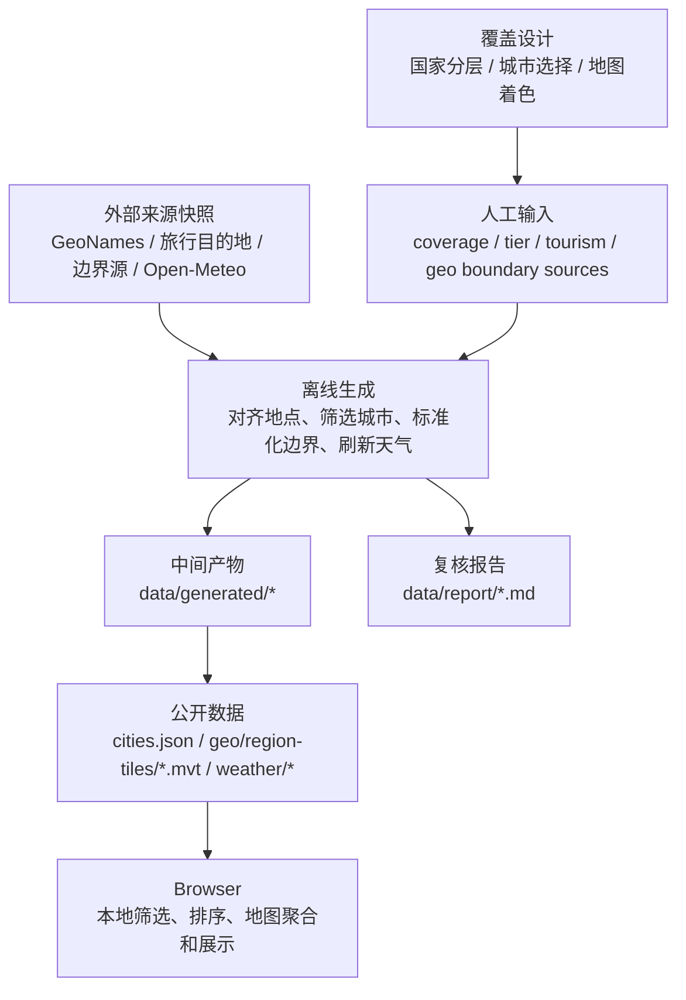
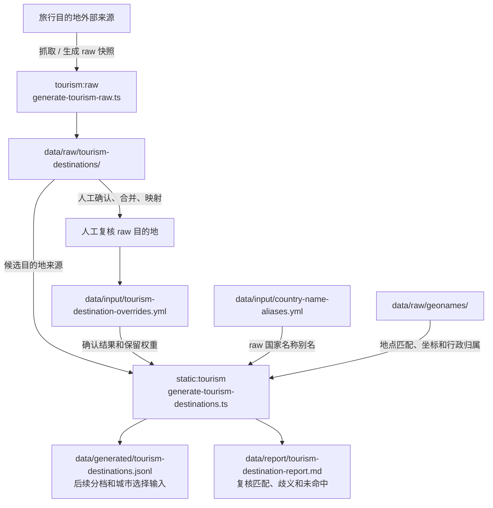
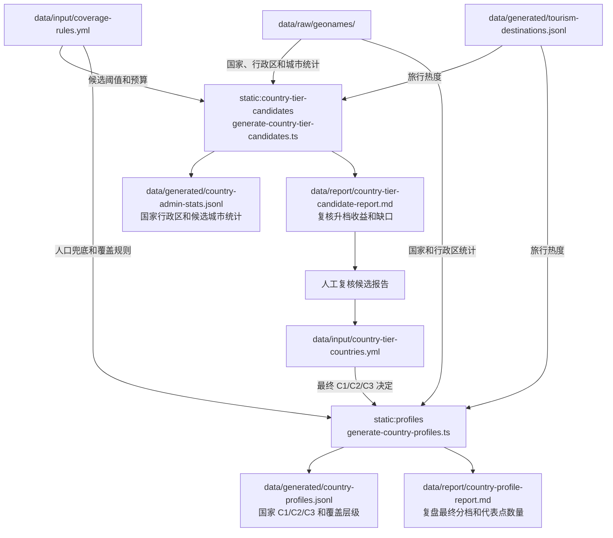
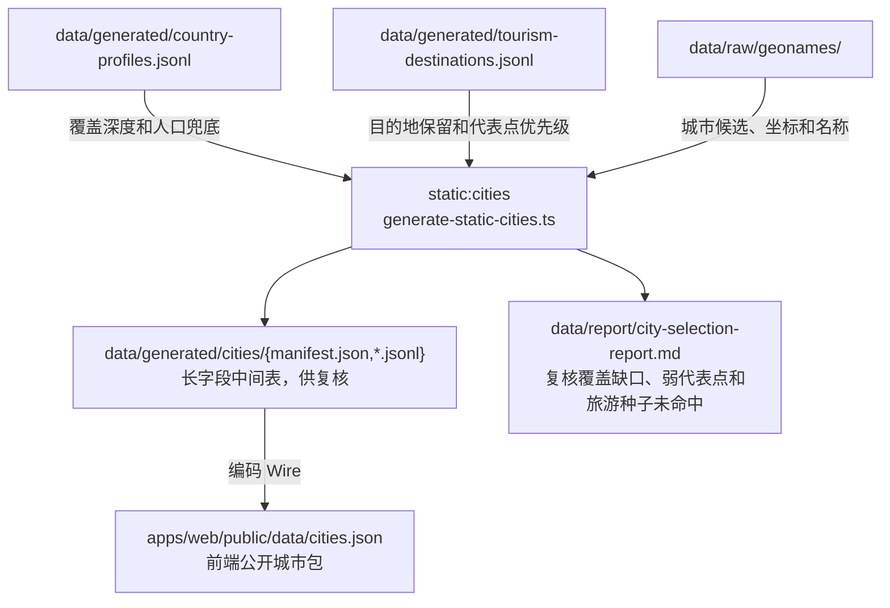
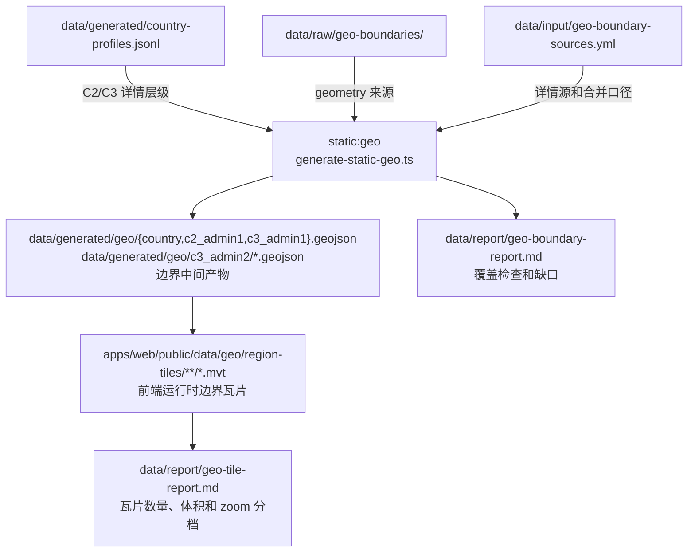
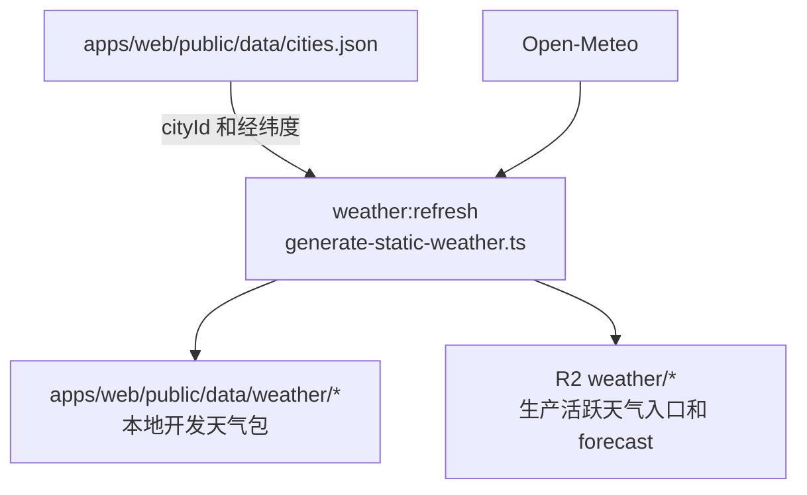

# 数据源与 Data Flow

## 文档边界

天气覆盖策略、C1/C2/C3 分层、城市选择和区域着色口径见 `docs/specs/30-weather-coverage-design.md`。公开数据如何分块、Wire 字段如何组织、浏览器如何请求和缓存见 `docs/specs/32-public-data-contract.md`。本文只定义数据从哪里来、经过哪些生成步骤、产出到哪里，以及哪些判断必须留在离线生成阶段。

Weather Trip 使用静态公开数据运行。用户请求读取 Pages 和 R2 上的 JSON / MVT / `.bin`，不连接数据库，不调用请求时 API，也不通过 Pages Functions 或 Workers 代理公开数据。

## 五类数据源

Weather Trip 同时使用五类数据源：

| 类型 | 负责内容 | 用途 |
| --- | --- | --- |
| 城市 / city | 地点名称、坐标、海拔、时区、人口、行政区代码 | 生成城市主索引；这里的 `city` 是产品对象，不等于外部来源里的全量 populated place |
| 点位天气 | 按经纬度生成 14 天预报 | 生成天气 current 和 forecast 包 |
| 行政边界 | 国家、一级区域、二级区域 polygon | 生成世界边界包和 C3 国家详情包 |
| 地图底图 | 道路、地名、水系、底色和地图交互背景 | 浏览器地图底座，不参与数据计算 |
| 天气瓦片 | 雷达、降水、温度、风、云等栅格/瓦片图层 | 未来可选视觉层，不参与城市筛选、评分、排序或区域聚合 |

这五类数据不能混成一个“地图数据”。底图只负责视觉上下文；行政边界负责可 hover、可着色、可聚合的区域；`city` 负责每天请求天气的坐标；点位天气负责列表、marker 和区域聚合；天气瓦片只是一张供应商渲染好的天气背景图。它们叠在同一张地图上，但真源、授权、更新频率和可复跑方式都不同。

没有一个低成本来源能同时稳定提供 `city`、点位天气、行政边界、地图底图和天气瓦片，并保证这些对象使用同一套行政编码、边界和天气模型。项目采用“分层数据源 + 离线对齐 + 报告审计”：

```text
GeoNames / raw tourism / input
  -> 城市 / city

Open-Meteo Forecast API
  -> 点位天气

Natural Earth / geoBoundaries / DataV-高德（Amap）
  -> 行政边界

OpenStreetMap raster tiles
  -> 地图底图

weather map tiles provider
  -> 未来可选天气视觉层
```

## 数据产物分层

离线数据按读写者分层。每一层只为自己的读写者优化，不把前端压缩格式带进人工输入，也不为了人读得舒服牺牲 public 传输性能。

| 层级 | 读写者 | 内容和格式原则 |
| --- | --- | --- |
| `raw` | 生成脚本读取，外部抓取任务写入 | 外部来源快照和原始字段；保留来源语义，按来源原生 JSON、CSV、ZIP、GeoJSON 等格式保存 |
| `input` | 人工维护，生成脚本读取 | 覆盖规则、人工确认名单、边界口径和补充别名；优先 YAML，方便备注、分组和小规模增删 |
| `generated` | 生成脚本写入，后续生成脚本和人工审阅读取 | 可复跑中间结果、长字段行表、标准边界包和瓦片前检查表；小对象用 JSON，长数组和表格用 JSONL，GeoJSON 的 `features` 每个 feature 单行 |
| `report` | 生成脚本写入，人工阅读 | 复核结论、缺口、统计和下一步判断；优先 Markdown，表格承载统计和并列检查项 |
| `public` | 生成脚本写入，浏览器读取 | 城市索引、地图瓦片、天气入口和 forecast 包；优先加载、缓存和解析性能，可以使用 Wire 短字段、MVT 和二进制包 |

## 跨源对齐原则

各数据域尽量从自己的主来源生成可独立发布的产物，再在关联层做弱连接。行政区划、城市点位、天气模型和底图来自不同机构，不同国家的行政区划版本也可能不同：同一个国家的省、州、县、市边界在 GeoNames、geoBoundaries、Natural Earth、DataV/高德、OSM 和天气供应商里可能采用不同年份、不同层级或不同编码。系统不能把跨源完全一致当成前提。

每条数据流先保证自己的对象能独立成立。城市主索引以 Weather Trip 选出的 `cityId` 和经纬度为真源；天气包按 `cityId` 附加 forecast；Geo 区块以边界源原生 polygon 和 `regionKey` 为真源；地图底图只提供视觉背景。跨源关联使用稳定 key 和报告审计，能可靠关联时写入 `weatherRegionKey` 或天气样本；不能可靠关联时保留原数据，只让关联结果进入无数据、空列表或复核状态。

特例必须服从同一套规则。代码里只处理稳定、规范、能被统一规则解释的大场景，例如中国直辖市的天气样本代表一级行政区，因此不继续生成区县天气区块；港澳台作为中国边界 companion 区块处理，同时保留独立 C1 地区入口。少数名称、编码、来源层级或人工跳过项不能写成隐藏补丁表；这类对象级补丁写入 `data/input/*.yml`，并在生成报告里可追溯。

这个规则尤其适用于 Geo 区块。`static:geo` 从边界 raw、国家分档和少量边界源口径输入生成可渲染区块，`static:geo:tiles` 直接把这些区块切成 MVT。天气包、城市天气样本或某个行政编码匹配失败时，不能删除 Geo 区块，也不能用相邻区域、国家平均值或几何中心推断天气；前端按 `regionKey` 渲染边界，按 `weatherRegionKey ?? regionKey` 查天气样式，查不到就显示无数据样式。

## 关联和展示字段

城市和区块的天气关联以 key 为运行时契约，不在浏览器里做点在面内的几何判断。城市主索引保存 GeoNames 行政编码和 `cityId`；边界 feature 保存边界源原生 `regionKey` 和可选 `weatherRegionKey`。区域天气 summary 由城市编码生成，地图渲染时用 `weatherRegionKey ?? regionKey` 查 summary。GeoNames、geoBoundaries、Natural Earth、DataV/高德和天气源的行政版本不一致时，某些肉眼落在区块内的城市可能无法按编码关联到该区块，这类缺口进入报告或无数据样式。

对齐修正放在离线生成层。生成任务可以用 point-in-polygon 把城市坐标落到边界 polygon，产出审计用的 `cityId -> regionKey` 结果，再把可确认的修正折叠进城市 region key、区块 `weatherRegionKey` 或人工 override。几何包含只能作为审计线索，不能覆盖城市样本的代表范围；例如北京、上海、天津、重庆的城市天气点代表整个直辖市，不归入坐标所在区县。其他国家如果出现首都特区、大都会区或自治市这类同样的范围错位，也按同一规则处理：天气样本停在可代表层级，二级边界只有在可可靠关联时才着色。这个中间结果不作为前端运行时必需文件；前端仍只加载 `cities.json`、MVT 和天气包，避免为了关联关系增加流量和浏览器计算。

Hover 名称分两路：城市 marker 的名称和地区路径来自 `cities.json` 解码后的城市、国家、一级/二级区域字典；区块 hover 的名称来自 MVT feature 的 `labelZh` / `labelEn`，这些 label 由边界生成阶段从边界源和生成代码里的固定来源解释规则写入。区块有天气 summary 时追加当前图层指标；没有 summary 时仍显示区块名和无数据文案。

海拔图层使用样本城市海拔，不表示行政面真实平均海拔。城市海拔优先使用天气源返回的点位 `sourceElevationMeters`，没有时回退到 `cities.json` 的 `elevationM`，而城市主索引的 `elevationM` 来自 GeoNames `elevation` / `dem`。区块海拔按已关联城市求平均；没有关联城市时显示无数据。当前边界源和生成后的 MVT 不保存区块自己的 elevation / DEM 字段，因此不做区块海拔兜底；如果后续引入可信的地形栅格或区块海拔来源，也应在离线阶段写入可审计字段，不在浏览器里临时推断。

## 城市来源

`city` 回答“哪些地方每天刷新天气”。它需要稳定 ID、中英文名、经纬度、海拔、国家、一级区域、二级区域和排序依据。

城市候选池使用 [GeoNames 官方导出](https://download.geonames.org/export/dump/)并叠加生成后的旅游目的地输入和人工覆盖规则。[Open-Meteo Geocoding](https://open-meteo.com/en/docs/geocoding-api) 也基于 GeoNames，并返回坐标、海拔、时区、人口和行政字段，适合做校验和补全参考，但不作为运行时搜索真源。

GeoNames 的 populated place 不等于旅游目的地全集，也会包含区县、片区、小镇和景点附近点位。公开数据里的 `city` 是 Weather Trip 的城市对象，大多数是城市，少数是代表地点。

| 方案 | 优点 | 限制 | 适合度 |
| --- | --- | --- | --- |
| [GeoNames 导出](https://download.geonames.org/export/dump/) | 免费、可离线生成、ID 稳定、字段覆盖全球，可提交生成产物 | 旅游语义弱，行政口径和边界源不天然一致，中文名需要 alternate names | 采用 |
| [Open-Meteo Geocoding](https://open-meteo.com/en/docs/geocoding-api) | 与 Open-Meteo 天气接口同生态，返回 GeoNames 位置字段 | 没有行政边界，不适合替代离线筛选流程 | 辅助校验 |
| [OpenWeather Geocoding](https://openweathermap.org/api/geocoding-api) | 与 OpenWeather 天气 API 配合，地点转经纬度方便 | 没有完整行政边界库，地点字段不足以生成 C1/C2/C3 工作流 | 替代天气方案时评估 |
| [Google Places](https://developers.google.com/maps/documentation/places/web-service/overview) / [Geocoding](https://developers.google.com/maps/documentation/geocoding/overview) | 地点搜索质量强，Place ID 可和 Google 边界 styling 连接 | 生产计费、运行时依赖强、不可静态化为完整地点包 | 一体化付费方案候选 |
| [Mapbox](https://docs.mapbox.com/api/search/geocoding/) / [MapTiler](https://docs.maptiler.com/cloud/api/geocoding/) / [Geoapify](https://www.geoapify.com/geocoding-api/) geocoding | 地图平台地点能力强，可和自家地图产品配套 | 不提供同源天气，需要外部天气源 | 后续评估 |

## 点位天气来源

点位天气回答“某个经纬度未来几天天气如何”。Weather Trip 的核心不是画天气背景图，而是比较旅行目的地天气，所以点位天气必须能按选出的城市批量刷新，并且可缓存、可排序、可聚合。

点位天气使用 [Open-Meteo Forecast API](https://open-meteo.com/en/docs)。它按经纬度请求，不要求 `city` 必须存在于供应商自己的城市目录，适合保留本项目自己的城市筛选逻辑。公开商业化或需要 SLA 时，需要评估 [Open-Meteo customer API](https://open-meteo.com/en/pricing)、自托管，或替代天气源。

| 方案 | 优点 | 限制 | 适合度 |
| --- | --- | --- | --- |
| [Open-Meteo Forecast API](https://open-meteo.com/en/docs) | 成本友好，支持按经纬度请求，多模型，和 GeoNames 点位生态接近 | 没有行政边界；免费 API 有非商业和限额边界 | 采用 |
| [OpenWeather](https://openweathermap.org/api) | 天气 API 和天气地图产品成熟 | 地点、天气、天气瓦片可以同供应商，但行政边界仍缺失 | 备选 |
| [Tomorrow.io](https://www.tomorrow.io/weather-api/) | 天气 API 和天气瓦片能力强，适合行业场景 | 不提供全球行政边界体系 | 备选天气层 |
| [Visual Crossing](https://www.visualcrossing.com/weather-api/) | 单 endpoint 处理地点字符串和天气查询方便 | 没有行政边界库；地点解析结果和边界仍需对齐 | 备选 |
| [Meteomatics](https://www.meteomatics.com/en/api/) | 专业天气 API，适合复杂气象变量和企业需求 | 更偏天气数据源，不是地点/边界/底图一体平台 | 后续评估 |
| [Google Weather API](https://developers.google.com/maps/documentation/weather) | 与 Google Maps Platform 生态连接最好 | 生产计费，天气结果与静态 GeoJSON 工作流不自然对齐 | 只在 Google 一体化方案中考虑 |

Open-Meteo 返回的 `daily.time` 表示地点当地自然日，而非 UTC 时间戳。因为请求使用 `timezone=auto`，中国城市按各自地点时区日期理解，美国、日本、欧洲等城市也按各自地点时区日期理解。天气缓存日期按这个 date-only 语义保存。读取和比较日期时不能把地点当地自然日转换成 UTC 日期，否则跨时区城市会出现日期前后偏移，导致缓存判断失真。

## 行政边界来源

行政边界回答“地图上哪些块可以被着色、hover 和点击”。它需要低精度世界包、国家详情包、稳定 `regionKey` 和生成报告。边界与天气分开：缺天气数据时区域仍然显示边界，按无数据样式展示。

行政边界使用多源离线生成：[Natural Earth](https://www.naturalearthdata.com/features/) 提供低精度世界国家包和非中国一级区域兜底，[geoBoundaries](https://www.geoboundaries.org/api.html) 提供可下载的多级行政边界，[DataV/高德（Amap）](https://geo.datav.aliyun.com/areas_v3/bound/100000_full.json) 提供中国国家、省级、地级和港澳台详情边界。非中国 C2/C3 详情层优先使用 geoBoundaries 原生 ADM1/ADM2/ADM3，不再把边界强行改造成 GeoNames 行政树；`regionKey` 表示边界源自身的稳定区块。`weatherRegionKey` 只在边界源编码可直接关联，或边界名称能唯一匹配 GeoNames 二级行政区时写入；匹配不唯一或代表范围不一致时不写。没有天气关联的区块仍保留边界，并由前端显示无数据样式。

中国边界使用 DataV/高德行政边界接口。`100000.json` 生成 `country:CN` 国家面；`100000_full.json` 生成中国大陆省级 `admin1:CN.*`，并通过稳定 adcode 映射写入对应 `weatherRegionKey`；香港、澳门和台湾同时作为 `admin1:CN.HK/MO/TW` 和 companion C3 区块放入 `CN` 详情包。非直辖市省级 `<adcode>_full.json` 生成地级区块，地级 adcode 派生为中国详情层的天气关联 key。北京、上海、天津、重庆停在 `admin1:CN.*`，不发布区县级天气区块。香港和澳门使用 DataV/高德 `_full` 子区块并共享各自天气聚合 key；台湾的 DataV/高德可用边界为整体区块。

| 方案 | 优点 | 限制 | 适合度 |
| --- | --- | --- | --- |
| [Natural Earth](https://www.naturalearthdata.com/features/) | 免费，提供多精度，世界级包很适合压缩 | 行政层级有限，不覆盖全球 admin2 | 世界包基础源 |
| [geoBoundaries](https://www.geoboundaries.org/api.html) | API 支持 ADM0-ADM5，适合离线下载，元数据包含来源、许可证和统计 | 国家质量和口径随来源变化，需要脚本审计 | 详情包基础源 |
| [DataV/高德中国边界](https://geo.datav.aliyun.com/areas_v3/bound/100000_full.json) | 中国国家、省级和地级区块完整度好，也能提供香港、澳门子区块和台湾整体边界 | 高德 adcode 与天气聚合 key 需要稳定映射；自治区直辖县级市、兵团城市和 companion C3 口径需审计 | 中国边界源 |
| [Mapbox Boundaries](https://docs.mapbox.com/data/boundaries/) | 商业边界产品成熟，可和 Mapbox 地图生态结合 | 商业授权，静态导出和长期 Git 提交需要按合同确认 | 后续评估 |
| [MapTiler Countries](https://www.maptiler.com/countries/) | 提供国家、领土、邮编等边界产品，可用于 choropleth | 商业平台，不提供天气 | 后续评估 |
| [Geoapify Boundaries API](https://www.geoapify.com/boundaries-api/) | 能取国家、省州、城市等 polygon，GeoJSON 友好 | API 计费/限额，不提供天气 | 后续评估 |
| [Google boundary styling](https://developers.google.com/maps/documentation/javascript/dds-boundaries/overview) | Place ID 与 Google 地图边界渲染连接强 | 主要是 Google Map 内 styling，不是静态 GeoJSON 边界源 | 只在 Google 一体化方案中考虑 |

## 地图底图和天气瓦片

地图底图回答“用户看到的地图背景是什么”。它不参与天气聚合，不提供本项目的 `regionKey`，也不保证和行政边界 GeoJSON 完全贴合。底图道路、水系、地名和边界线可能与叠加的 GeoJSON 有细微错位，这是多源叠图都会遇到的问题。

Web 地图使用 `https://tile.openstreetmap.org/{z}/{x}/{y}.png` 作为 raster tile。OSM 数据免费，但公共 tile 服务器不是无限免费 CDN；需要遵守 [OpenStreetMap public tile policy](https://operations.osmfoundation.org/policies/tiles/)，保留署名、遵守缓存，不做批量下载或离线预取。生产流量上来后，应切换到明确允许商业流量和缓存策略的托管瓦片服务，或自托管/使用商业 OSM 派生服务。

天气瓦片适合表达雷达、降水、风、温度场这类视觉信息，但不能替代点位天气数据。天气瓦片通常由供应商按自己的模型、插值、图例和时间轴渲染；城市列表、评分和区域聚合仍然来自点位天气。若启用天气瓦片，UI 需要明确图例来源和更新时间，并避免让用户误以为瓦片颜色就是城市卡片天气的真源。

## 数据链路

### 图 1：概念边界



上图只表达概念边界：外部来源保持 raw 语义，人工判断进入 input，离线任务写出 generated 中间产物和 report 复核报告，浏览器只读取 public JSON / MVT / `.bin`。脚本级生成流程按关键数据拆开，7 个生成脚本都在图里出现，但不要求一脚本一张图。

### 图 2：旅行目的地

旅行目的地生成包含 raw 快照生成和静态目的地生成。人工复核 raw 目的地后，只写回 `data/input/tourism-destination-overrides.yml`。



### 图 3：国家数据

国家数据的最终生成产物是 `data/generated/country-profiles.jsonl`。候选报告只用于人工复核，人工判断写回 `data/input/country-tier-countries.yml` 后，再生成 profiles；人工不直接修改候选报告或 profiles。



### 图 4：城市主索引

城市主索引是前端城市、marker、搜索和天气刷新点的真源；公开城市包由同一次生成复制到 Web public 目录。



### 图 5：Geo 区块数据

`static:geo` 使用 profiles、边界 raw 和边界源口径 input 生成按运行时层级拆分的 geo-native GeoJSON 中间产物，并在产物写出后检查国家、详情层 feature 和 admin1 面积覆盖。`static:geo:tiles` 再把这些中间产物切成前端运行时读取的三档 MVT 瓦片。



Geo 区块数据从边界源直达 MVT，天气只是渲染时附加的样式数据。`regionKey` 决定区块是否存在和能否 hover；`weatherRegionKey` 只决定能否复用城市天气聚合。边界源和城市/天气源版本不一致时，边界仍按原生区块发布，关联缺口进入报告和无数据样式。

`data/input/geo-boundary-sources.yml` 只处理边界源本身不能自动确定的口径：国家详情层需要选 geoBoundaries 的哪个 ADM 层级、国家轮廓是否要合并 Natural Earth 的多个 map unit、admin0 缺面的国家是否要补 Natural Earth admin1 面。它不保存城市到区块的映射，也不保存天气聚合规则。

### 图 6：天气刷新

`weather:refresh` 只依赖生成后的城市主索引和天气源。本地默认写入 `apps/web/public/data/weather/*`，CI 可通过参数生成 R2 上传目录。



`data/generated/tourism-destinations.jsonl` 和 `data/generated/country-profiles.jsonl` 都是生成产物，不手工维护。覆盖规则、raw 旅行清单和人工输入进入固定生成链路后，从 GeoNames raw 到最终城市、边界和天气 JSON 都可重复运行。

边界和天气是两条数据流。MVT 区块即使没有天气样本也必须保留，前端按无数据样式展示；天气缺失只影响颜色和 tooltip 的数据内容，不决定区块是否存在。高 zoom 瓦片包会包含低层级 fallback，例如 C1 的 `country:*`、C2 的 `admin1:*` 和 C3 的 `admin2:*` / `boundary:*`，无数据样式要保留这些合法层级，不能只显示当前 zoom 名义上的最高层级。底图不生成本项目的 `regionKey`，也不能反向影响区域聚合。

Geo 区块数据生成按前端会加载的 zoom 档校验输出。`country` 档需要 `country:*`，`admin1` 档需要边界源原生 `admin1:*`，`admin2` 档需要边界源原生 `admin2:*` / `boundary:*`。`scripts/generate-static-geo.ts` 根据 profiles 检查每个 C2/C3 国家是否生成详情区块，并用 admin1 面积与国家轮廓面积的比例捕捉“数量存在但空间缺块”的问题；`scripts/generate-static-geo-tiles.ts` 负责统计三档瓦片数量、最大单瓦片和缺失国家边界。缺失时生成任务失败退出，不能只靠人工看报告发现。

需要人工判断时，只补充 `data/input/*.yml` 或覆盖规则，不直接修改生成产物。

## 运行边界

| 能力 | 设计 | 原因 |
| --- | --- | --- |
| 网页入口 | Cloudflare Pages | 页面入口、预览部署、回滚和自定义域名由 Pages 处理 |
| 天气数据对象 | Cloudflare R2 Standard storage | 每日变化的公开 JSON 适合对象存储 |
| 刷新计算 | GitHub Actions | Open-Meteo 批量刷新会产生外部请求、重试和校验，放在 CI 更稳 |
| 请求时 API | 不使用 Pages Functions / Workers | 公开数据不需要请求时计算 |
| 运行时数据库 | 无 | 数据是公开快照，前端可以本地查询；数据库会增加运行时路径和迁移成本 |
| R2 上传凭据 | bucket-scoped S3-compatible Object Read & Write token | CI 只需要写入目标 bucket，不持有账号级 Cloudflare API Token |

Cloudflare 和 Open-Meteo 的额度以官方文档为准。执行部署前重新核对 Cloudflare Pages limits、Pages Functions pricing、Workers limits、R2 pricing、Open-Meteo pricing 和 Open-Meteo Forecast API 文档。

## 落地检查

| 检查项 | 标准 |
| --- | --- |
| 来源分层 | `city`、点位天气、行政边界、底图和天气瓦片保持独立真源 |
| 人工判断 | 人工或 AI 判断只进入 `data/input/*.yml` 或覆盖规则，不直接写生成产物 |
| 覆盖规则 | 本文不定义与 `docs/specs/30-weather-coverage-design.md` 冲突的城市选择规则 |
| 生成链路 | 城市、边界和天气能分别复跑，并输出可审计报告 |
| 区域对齐 | 前端用 `regionKey` 标识边界 feature，用可选 `weatherRegionKey` 匹配天气 summary，不读取供应商 adcode 或名称匹配过程 |
| 对齐修正 | 点在面内校准只在离线生成阶段执行，产物折叠进现有 key，不新增前端必需关联文件 |
| 无数据区块 | 高 zoom fallback 的 country / admin1 / admin2 / boundary 区块在无天气样本时仍可 hover 和显示无数据样式 |
| 展示字段 | 城市 hover 名称来自 `cities.json`；区块 hover 名称来自 MVT `labelZh` / `labelEn`；区块海拔来自样本城市平均值 |
| 产物格式 | input 易手写且可解析；generated 可 diff、可审阅且不过度膨胀；report 适合人工复核；public 优先加载和缓存性能 |
| 运行边界 | 用户请求不经过 Pages Functions / Workers 代理 JSON，不连接运行时数据库 |

## 官方参考

- Cloudflare Pages limits: <https://developers.cloudflare.com/pages/platform/limits/>
- Cloudflare Pages Functions pricing: <https://developers.cloudflare.com/pages/functions/pricing/>
- Cloudflare Workers limits: <https://developers.cloudflare.com/workers/platform/limits/>
- Cloudflare R2 pricing: <https://developers.cloudflare.com/r2/pricing/>
- Open-Meteo pricing: <https://open-meteo.com/en/pricing>
- Open-Meteo Forecast API: <https://open-meteo.com/en/docs>
