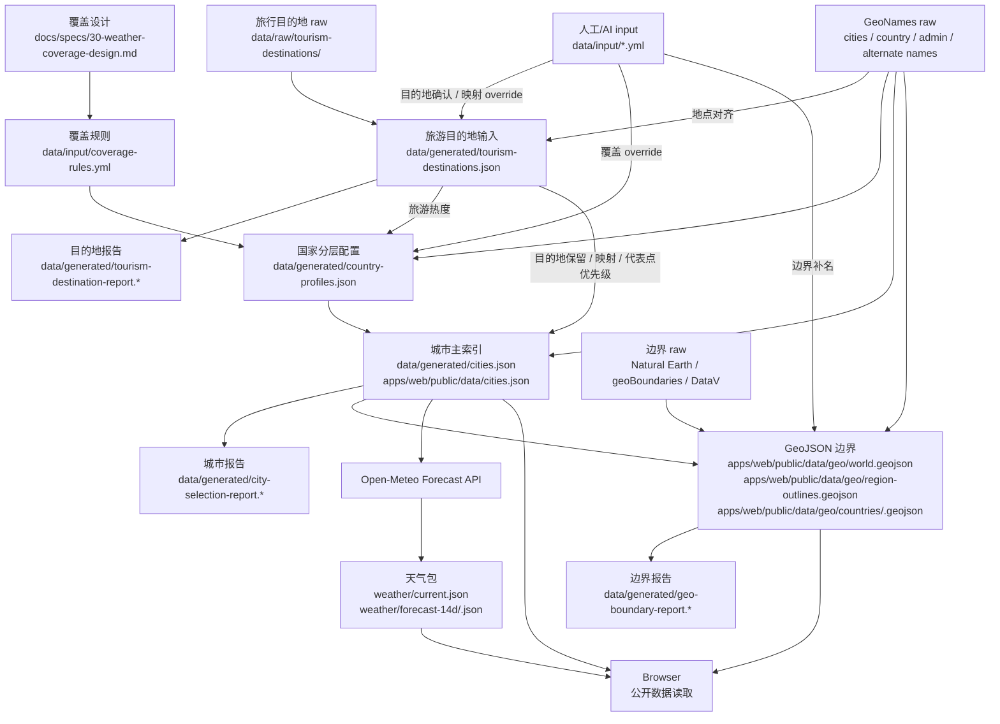

# 数据源与 Data Flow

## 文档边界

天气覆盖策略、C1/C2/C3 分层、城市选择和区域着色口径见 `docs/specs/30-weather-coverage-design.md`。公开数据如何分块、Wire 字段如何组织、浏览器如何请求和缓存见 `docs/specs/32-public-data-contract.md`。本文只定义数据从哪里来、经过哪些生成步骤、产出到哪里，以及哪些判断必须留在离线生成阶段。

Weather Trip 使用静态公开数据运行。用户请求读取 Pages 和 R2 上的 JSON / GeoJSON，不连接数据库，不调用请求时 API，也不通过 Pages Functions 或 Workers 代理公开数据。

## 五类数据源

Weather Trip 同时使用五类数据源：

| 类型 | 负责内容 | 用途 |
| --- | --- | --- |
| 城市 / city | 地点名称、坐标、海拔、时区、人口、行政区代码 | 生成城市主索引；这里的 `city` 是产品对象，不等于外部来源里的全量 populated place |
| 点位天气 | 按经纬度生成 14 天预报 | 生成天气 current 和 forecast 包 |
| 行政边界 | 国家、一级区域、二级区域 polygon | 生成世界边界包和 C3 国家详情包 |
| 地图底图 | 道路、地名、水系、底色和地图交互背景 | 浏览器地图底座，不参与数据计算 |
| 天气瓦片 | 雷达、降水、温度、风、云等栅格/瓦片图层 | 未来可选视觉层，不参与城市筛选、评分、排序或区域聚合 |

这五类数据不能混成一个“地图数据”。底图只负责视觉上下文；行政边界负责可 hover、可着色、可聚合的区域；`city` 负责每天请求天气的坐标；点位天气负责列表、marker 和区域聚合；天气瓦片只是一张供应商渲染好的天气背景图。它们叠在同一张地图上，但真源、授权、更新频率和可复跑方式都不同。

没有一个低成本来源能同时稳定提供 `city`、点位天气、行政边界、地图底图和天气瓦片，并保证这些对象使用同一套行政编码、边界和天气模型。项目采用“分层数据源 + 离线对齐 + 报告审计”：

```text
GeoNames / raw tourism / input
  -> 城市 / city

Open-Meteo Forecast API
  -> 点位天气

Natural Earth / geoBoundaries / DataV-高德（Amap）
  -> 行政边界

OpenStreetMap raster tiles
  -> 地图底图

weather map tiles provider
  -> 未来可选天气视觉层
```

可自动抽取的旅行目的地原始清单进入 `data/raw/tourism-destinations/`。人工或 AI 判断进入 `data/input/*.yml`。生成任务把 raw、input 和 GeoNames 混合成 `data/generated/*` 与 `data/generated/*-report.*`，前端运行时只使用统一的 `regionKey`、`city` 和天气快照。

## 城市来源

`city` 回答“哪些地方每天刷新天气”。它需要稳定 ID、中英文名、经纬度、海拔、国家、一级区域、二级区域和排序依据。

城市候选池使用 [GeoNames 官方导出](https://download.geonames.org/export/dump/)并叠加生成后的旅游目的地输入和人工覆盖规则。[Open-Meteo Geocoding](https://open-meteo.com/en/docs/geocoding-api) 也基于 GeoNames，并返回坐标、海拔、时区、人口和行政字段，适合做校验和补全参考，但不作为运行时搜索真源。

GeoNames 的 populated place 不等于旅游目的地全集，也会包含区县、片区、小镇和景点附近点位。公开数据里的 `city` 是 Weather Trip 的城市对象，大多数是城市，少数是代表地点。

| 方案 | 优点 | 限制 | 适合度 |
| --- | --- | --- | --- |
| [GeoNames 导出](https://download.geonames.org/export/dump/) | 免费、可离线生成、ID 稳定、字段覆盖全球，可提交生成产物 | 旅游语义弱，行政口径和边界源不天然一致，中文名需要 alternate names | 采用 |
| [Open-Meteo Geocoding](https://open-meteo.com/en/docs/geocoding-api) | 与 Open-Meteo 天气接口同生态，返回 GeoNames 位置字段 | 没有行政边界，不适合替代离线筛选流程 | 辅助校验 |
| [OpenWeather Geocoding](https://openweathermap.org/api/geocoding-api) | 与 OpenWeather 天气 API 配合，地点转经纬度方便 | 没有完整行政边界库，地点字段不足以生成 C1/C2/C3 工作流 | 替代天气方案时评估 |
| [Google Places](https://developers.google.com/maps/documentation/places/web-service/overview) / [Geocoding](https://developers.google.com/maps/documentation/geocoding/overview) | 地点搜索质量强，Place ID 可和 Google 边界 styling 连接 | 生产计费、运行时依赖强、不可静态化为完整地点包 | 一体化付费方案候选 |
| [Mapbox](https://docs.mapbox.com/api/search/geocoding/) / [MapTiler](https://docs.maptiler.com/cloud/api/geocoding/) / [Geoapify](https://www.geoapify.com/geocoding-api/) geocoding | 地图平台地点能力强，可和自家地图产品配套 | 不提供同源天气，需要外部天气源 | 后续评估 |

## 点位天气来源

点位天气回答“某个经纬度未来几天天气如何”。Weather Trip 的核心不是画天气背景图，而是比较旅行目的地天气，所以点位天气必须能按选出的城市批量刷新，并且可缓存、可排序、可聚合。

点位天气使用 [Open-Meteo Forecast API](https://open-meteo.com/en/docs)。它按经纬度请求，不要求 `city` 必须存在于供应商自己的城市目录，适合保留本项目自己的城市筛选逻辑。公开商业化或需要 SLA 时，需要评估 [Open-Meteo customer API](https://open-meteo.com/en/pricing)、自托管，或替代天气源。

| 方案 | 优点 | 限制 | 适合度 |
| --- | --- | --- | --- |
| [Open-Meteo Forecast API](https://open-meteo.com/en/docs) | 成本友好，支持按经纬度请求，多模型，和 GeoNames 点位生态接近 | 没有行政边界；免费 API 有非商业和限额边界 | 采用 |
| [OpenWeather](https://openweathermap.org/api) | 天气 API 和天气地图产品成熟 | 地点、天气、天气瓦片可以同供应商，但行政边界仍缺失 | 备选 |
| [Tomorrow.io](https://www.tomorrow.io/weather-api/) | 天气 API 和天气瓦片能力强，适合行业场景 | 不提供全球行政边界体系 | 备选天气层 |
| [Visual Crossing](https://www.visualcrossing.com/weather-api/) | 单 endpoint 处理地点字符串和天气查询方便 | 没有行政边界库；地点解析结果和边界仍需对齐 | 备选 |
| [Meteomatics](https://www.meteomatics.com/en/api/) | 专业天气 API，适合复杂气象变量和企业需求 | 更偏天气数据源，不是地点/边界/底图一体平台 | 后续评估 |
| [Google Weather API](https://developers.google.com/maps/documentation/weather) | 与 Google Maps Platform 生态连接最好 | 生产计费，天气结果与静态 GeoJSON 工作流不自然对齐 | 只在 Google 一体化方案中考虑 |

Open-Meteo 返回的 `daily.time` 表示地点当地自然日，而非 UTC 时间戳。因为请求使用 `timezone=auto`，中国城市按各自地点时区日期理解，美国、日本、欧洲等城市也按各自地点时区日期理解。天气缓存日期按这个 date-only 语义保存。读取和比较日期时不能把地点当地自然日转换成 UTC 日期，否则跨时区城市会出现日期前后偏移，导致缓存判断失真。

## 行政边界来源

行政边界回答“地图上哪些块可以被着色、hover 和点击”。它需要低精度世界包、国家详情包、稳定 `regionKey` 和生成报告。边界与天气分开：缺天气数据时区域仍然显示边界，按无数据样式展示。

行政边界使用多源离线生成：[Natural Earth](https://www.naturalearthdata.com/features/) 提供低精度世界国家和一级区域基础包，[geoBoundaries](https://www.geoboundaries.org/api.html) 提供可下载的多级行政边界，[DataV/高德（Amap）](https://geo.datav.aliyun.com/areas_v3/bound/100000_full.json) 作为中国详情边界来源。生成阶段优先使用 Natural Earth `gn_id` 对齐 GeoNames admin1；当边界源实际是下级区域时，先用 ADM2 名称对齐 GeoNames admin2 再聚合成 admin1；遇到行政改革、旧边界源或无城市点分片时，再按 GeoNames 城市点、ADM1 父边界包含和最近城市兜底把同一国家的边界碎片聚合到当前 admin1。`gn_a1_code` 只作为低优先级兜底，不作为完整匹配依据。最终前端只看到统一 `regionKey`，不看到供应商 adcode、GeoNames code 或名称匹配过程。

中国二级边界不能依赖通用边界源。当前 `CN` 展示口径是中国，使用 DataV/高德行政边界接口 `https://geo.datav.aliyun.com/areas_v3/bound/<adcode>_full.json` 生成中国大陆地级区块，再对齐到 GeoNames admin2 或保留为 boundary-only 区块；同时把香港、澳门和台湾作为 companion C3 区块放入 `CN` 详情包。香港和澳门使用 DataV/高德 `_full` 子区块并共享各自天气聚合 key；台湾的 DataV/高德可用边界为整体区块。

| 方案 | 优点 | 限制 | 适合度 |
| --- | --- | --- | --- |
| [Natural Earth](https://www.naturalearthdata.com/features/) | 免费，提供多精度，世界级包很适合压缩 | 行政层级有限，不覆盖全球 admin2 | 世界包基础源 |
| [geoBoundaries](https://www.geoboundaries.org/api.html) | API 支持 ADM0-ADM5，适合离线下载，元数据包含来源、许可证和统计 | 国家质量和口径随来源变化，需要脚本审计 | 详情包基础源 |
| [DataV/高德中国边界](https://geo.datav.aliyun.com/areas_v3/bound/100000_full.json) | 中国大陆地级区块完整度好，也能提供香港、澳门子区块和台湾整体边界 | 高德 adcode 和 GeoNames admin2 不是同一编码体系；自治区直辖县级市、兵团城市和 companion C3 口径需审计 | 中国详情源 |
| [Mapbox Boundaries](https://docs.mapbox.com/data/boundaries/) | 商业边界产品成熟，可和 Mapbox 地图生态结合 | 商业授权，静态导出和长期 Git 提交需要按合同确认 | 后续评估 |
| [MapTiler Countries](https://www.maptiler.com/countries/) | 提供国家、领土、邮编等边界产品，可用于 choropleth | 商业平台，不提供天气 | 后续评估 |
| [Geoapify Boundaries API](https://www.geoapify.com/boundaries-api/) | 能取国家、省州、城市等 polygon，GeoJSON 友好 | API 计费/限额，不提供天气 | 后续评估 |
| [Google boundary styling](https://developers.google.com/maps/documentation/javascript/dds-boundaries/overview) | Place ID 与 Google 地图边界渲染连接强 | 主要是 Google Map 内 styling，不是静态 GeoJSON 边界源 | 只在 Google 一体化方案中考虑 |

## 地图底图和天气瓦片

地图底图回答“用户看到的地图背景是什么”。它不参与天气聚合，不提供本项目的 `regionKey`，也不保证和行政边界 GeoJSON 完全贴合。底图道路、水系、地名和边界线可能与叠加的 GeoJSON 有细微错位，这是多源叠图都会遇到的问题。

Web 地图使用 `https://tile.openstreetmap.org/{z}/{x}/{y}.png` 作为 raster tile。OSM 数据免费，但公共 tile 服务器不是无限免费 CDN；需要遵守 [OpenStreetMap public tile policy](https://operations.osmfoundation.org/policies/tiles/)，保留署名、遵守缓存，不做批量下载或离线预取。生产流量上来后，应切换到明确允许商业流量和缓存策略的托管瓦片服务，或自托管/使用商业 OSM 派生服务。

天气瓦片适合表达雷达、降水、风、温度场这类视觉信息，但不能替代点位天气数据。天气瓦片通常由供应商按自己的模型、插值、图例和时间轴渲染；城市列表、评分和区域聚合仍然来自点位天气。若启用天气瓦片，UI 需要明确图例来源和更新时间，并避免让用户误以为瓦片颜色就是城市卡片天气的真源。

## 数据链路



具体链路：

```text
data/input/coverage-rules.yml
data/input/admin2-support-overrides.yml
GeoNames raw
  -> data/generated/country-admin-stats.json
  -> data/generated/country-tier-candidate-report.json / .md

data/generated/country-tier-candidate-report.md
人工复核
  -> data/input/country-tier-countries.yml

data/input/country-tier-countries.yml
data/input/coverage-rules.yml
data/input/admin2-support-overrides.yml
GeoNames raw
data/generated/tourism-destinations.json
  -> data/generated/country-profiles.json
  -> data/generated/country-profile-report.json / .md

data/raw/tourism-destinations/*.json
data/input/tourism-destination-overrides.yml
GeoNames raw
  -> data/generated/tourism-destinations.json
  -> data/generated/tourism-destination-report.json / .md

data/generated/country-profiles.json
data/generated/tourism-destinations.json
GeoNames raw
  -> data/generated/cities.json
  -> data/generated/city-selection-report.json / .md
  -> apps/web/public/data/cities.json

Natural Earth / geoBoundaries / DataV-高德 raw
data/generated/country-profiles.json
data/generated/cities.json
data/input/geo-boundary-sources.yml
data/input/boundary-label-overrides.yml
GeoNames admin raw
  -> apps/web/public/data/geo/world.geojson
  -> apps/web/public/data/geo/region-outlines.geojson
  -> apps/web/public/data/geo/countries/<C3-country>.geojson
  -> data/generated/geo-boundary-report.json / .md

Open-Meteo
  -> apps/web/public/data/weather/current.json
  -> apps/web/public/data/weather/forecast-14d/local.json
  -> R2 weather/current.json
  -> R2 weather/forecast-14d/<date>.json
```

`data/generated/tourism-destinations.json` 和 `data/generated/country-profiles.json` 都是生成产物，不手工维护。覆盖规则、raw 旅行清单和人工输入进入固定生成链路后，从 GeoNames raw 到最终城市、边界和天气 JSON 都可重复运行。

边界和天气是两条数据流。GeoJSON 区块即使没有天气样本也必须保留，前端按无数据样式展示；天气缺失只影响颜色和 tooltip 的数据内容，不决定区块是否存在。底图和天气瓦片不生成本项目的 `regionKey`，也不能反向影响区域聚合。

地图边界生成按前端会加载的视图校验输出。全球视图读取 `world.geojson`，其中 C1 城市聚合需要 `country:*`，C2/C3 城市聚合需要 `admin1:*`；选中地区高亮和地图定位读取 `region-outlines.geojson`，需要固定大区/洲和 C2/C3 国家这些可选项的完整轮廓；C3 国家详情读取 `countries/<country>.geojson`，需要对应 `admin2:*` 和人工保留的 `boundary:*`。`scripts/generate-static-geo.ts` 会从 `data/generated/cities.json` 推导当前前端会产生的 `regionKey`，再检查这些 key 是否存在于对应 GeoJSON 包，并确认每个可见 key 的 geometry 至少覆盖一个属于自己的城市点；同时 C2/C3 国家必须完整匹配 GeoNames admin1/admin2 目标集合。缺失或点位不覆盖时生成任务失败退出，不能只靠人工看报告发现。

## 生成产物与报告

| 文件 | 类型 | 维护方式 | 用途 |
| --- | --- | --- | --- |
| `data/input/coverage-rules.yml` | 输入规则 | 人工维护 | 国家分档阈值、预算、人口兜底和详细覆盖规则 |
| `data/raw/tourism-destinations/` | 来源 raw | 自动抽取，保留来源原样 | Wikivoyage、UN Tourism 和 UNESCO 等来源里的原始旅行目的地清单，只表达目的地和来源 |
| `data/input/tourism-destination-overrides.yml` | 输入 | 人工或 AI 辅助维护 | 人工确认的目的地、GeoNames 映射、处理模式和保留权重 |
| `data/generated/tourism-destinations.json` | 生成产物 | 生成任务输出，不手工改 | 混合 raw、人工 override 和 GeoNames 后的旅游目的地输入 |
| `data/generated/tourism-destination-report.json` / `.md` | 生成报告 | 生成任务输出 | raw 来源数量、名称匹配、歧义、未匹配和人工 override 对齐结果 |
| `data/input/country-tier-countries.yml` | 输入 | 人工复核候选报告后维护 | 国家层级人工复核名单；`countryTier: C1` 表示候选已复核但不升档，`reason` 不进入生成产物 |
| `data/input/admin2-support-overrides.yml` | 输入 | 人工复核 GeoNames admin2 口径后维护 | 过滤语义过细或不稳定的二级区域 |
| `data/input/geo-boundary-sources.yml` | 输入 | 人工复核边界报告后维护 | 国家详情层级和 Natural Earth map unit 合并口径 |
| `data/input/boundary-label-overrides.yml` | 输入 | 人工复核边界报告后维护 | boundary-only 区块展示名补充 |
| `data/generated/country-admin-stats.json` | 生成参考 | 生成任务输出 | 每个国家 admin1/admin2 数量、候选城市覆盖、空间跨度和旅游种子分数 |
| `data/generated/country-profiles.json` | 生成产物 | 生成任务输出，不手工改 | 国家 C1/C2/C3、详细区域层级和人口兜底 |
| `data/generated/country-tier-candidate-report.json` / `.md` | 生成报告 | `scripts/generate-country-tier-candidates.ts` 输出 | C2/C3 候选国家审阅表、候选优先级、升档城市增量、代表点重合和空间/旅行/行政指标 |
| `data/generated/country-profile-report.json` / `.md` | 生成报告 | 生成任务输出 | 国家分档结果、C2/C3 最终名单和代表点数量复盘 |
| `data/generated/cities.json` | 生成产物 | 生成任务输出，不手工改 | 城市列表源码产物，供复核和 Pages 构建复制 |
| `data/generated/city-selection-report.json` / `.md` | 生成报告 | 生成任务输出 | 覆盖缺口、弱代表点、旅游种子未命中和边界未匹配报告 |
| `data/generated/geo-boundary-report.json` / `.md` | 生成报告 | 生成任务输出 | 边界来源、匹配率、未匹配 `regionKey`、geometry 校验、简化前后尺寸和 feature 数 |

`country-tier-candidate-report.md` 由 `scripts/generate-country-tier-candidates.ts` 生成，只读取 GeoNames 国家/行政区/城市、生成后的旅游目的地输入、覆盖规则和 admin2 输入。表里按 C3 候选优先级排序，列出每个候选国家的国家代码、中文名、C2/C3 候选命中、C1/C2/C3 预计城市点数、升 C2/C3 的新增点数、代表点重合数、面积、经纬跨度、海拔跨度、旅行热度、空间分数、一级/二级行政区数量和二级区域城市覆盖率，不输出人工理由；命中 C3 的国家也会自动命中 C2，保证候选层级从粗到细单调包含。人工读这个表后，把最终决定写回 `data/input/country-tier-countries.yml`，再运行 `scripts/generate-country-profiles.ts` 生成 profiles。`countryTier: C1` 表示候选已复核但不升档；`reason` 只作为人工复核备注，生成脚本读取覆盖档位时会丢弃它；`country-profile-report.md` 只复盘最终选中的 C2/C3 国家和对应指标。

报告需要能解释国家分档、城市数量、C2/C3 代表点覆盖、中国地级行政区和 companion C3 口径、小目的地处理结果、`regionKey` 边界匹配、弱代表点和名称异常。需要人工判断时，只补充 `data/input/*.yml` 或覆盖规则，不直接修改生成产物。

## 运行边界

| 能力 | 设计 | 原因 |
| --- | --- | --- |
| 网页入口 | Cloudflare Pages | 页面入口、预览部署、回滚和自定义域名由 Pages 处理 |
| 天气数据对象 | Cloudflare R2 Standard storage | 每日变化的公开 JSON 适合对象存储 |
| 刷新计算 | GitHub Actions | Open-Meteo 批量刷新会产生外部请求、重试和校验，放在 CI 更稳 |
| 请求时 API | 不使用 Pages Functions / Workers | 公开数据不需要请求时计算 |
| 运行时数据库 | 无 | 数据是公开快照，前端可以本地查询；数据库会增加运行时路径和迁移成本 |
| R2 上传凭据 | bucket-scoped S3-compatible Object Read & Write token | CI 只需要写入目标 bucket，不持有账号级 Cloudflare API Token |

Cloudflare 和 Open-Meteo 的额度以官方文档为准。执行部署前重新核对 Cloudflare Pages limits、Pages Functions pricing、Workers limits、R2 pricing、Open-Meteo pricing 和 Open-Meteo Forecast API 文档。

## 落地检查

| 检查项 | 标准 |
| --- | --- |
| 来源分层 | `city`、点位天气、行政边界、底图和天气瓦片保持独立真源 |
| 人工判断 | 人工或 AI 判断只进入 `data/input/*.yml` 或覆盖规则，不直接写生成产物 |
| 覆盖规则 | 本文不定义与 `docs/specs/30-weather-coverage-design.md` 冲突的城市选择规则 |
| 生成链路 | 城市、边界和天气能分别复跑，并输出可审计报告 |
| 区域对齐 | 前端只消费统一 `regionKey`，不读取供应商 adcode、GeoNames code 或名称匹配过程 |
| 运行边界 | 用户请求不经过 Pages Functions / Workers 代理 JSON，不连接运行时数据库 |

## 官方参考

- Cloudflare Pages limits: <https://developers.cloudflare.com/pages/platform/limits/>
- Cloudflare Pages Functions pricing: <https://developers.cloudflare.com/pages/functions/pricing/>
- Cloudflare Workers limits: <https://developers.cloudflare.com/workers/platform/limits/>
- Cloudflare R2 pricing: <https://developers.cloudflare.com/r2/pricing/>
- Open-Meteo pricing: <https://open-meteo.com/en/pricing>
- Open-Meteo Forecast API: <https://open-meteo.com/en/docs>
