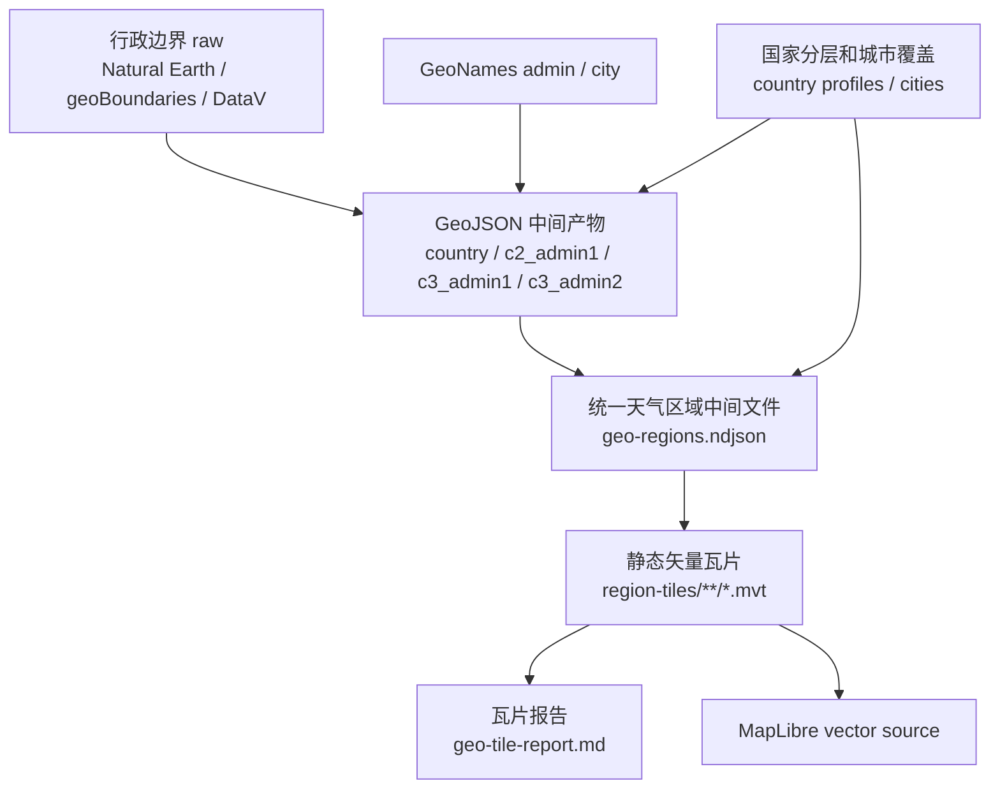

# 地图边界瓦片化性能优化方案

## 文档边界

本文定义把现有行政边界发布为静态矢量瓦片的性能优化方案。天气覆盖策略、C1/C2/C3 分层、城市选择和区域聚合口径仍以 `docs/specs/30-weather-coverage-design.md` 为准；数据来源和现有 GeoJSON 生成链路见 `docs/specs/31-data-flow.md`；地图 hover、点击和 marker 密度见 `docs/specs/22-weather-map-interactions.md`。

瓦片化只改变行政边界的发布和加载方式，不改变天气采样粒度，也不替代边界源清洗、GeoNames 对齐、国家分层复核和生成报告。

## 现状基线

前端运行时只读取 MVT 瓦片，不直接读取离线 GeoJSON 中间产物。GeoJSON 中间产物按运行时层级拆分，供 `static:geo:tiles` 消费：国家轮廓写入 `country.geojson`，C2/C3 一级区域分别写入 `c2_admin1.geojson` 和 `c3_admin1.geojson`，C3 二级区域按国家写入 `c3_admin2/<countryCode>.geojson`。

天气矩阵二进制优化降低了 forecast 对象和 GC 压力后，地图交互压力主要来自边界瓦片数量、单 tile 几何复杂度和 MapLibre 渲染。瓦片化要优先保证两个结果：世界视图不为高 zoom 细节加载完整边界；国家级详情只读取当前视口和 zoom 需要的边界片段。

## 目标

地图边界资源从按业务视图拆分的大 GeoJSON 包，迁移为按地图视口和缩放级别读取的静态矢量瓦片。浏览器只读取当前屏幕需要的瓦片片段，减少大范围地图打开和缩放时的边界传输、解析和渲染压力。

优化目标：

| 目标 | 说明 |
| --- | --- |
| 降低单次访问加载量 | 用户只读取当前视口和 zoom 需要的瓦片，不一次下载完整世界包或国家详情包 |
| 保持静态部署 | 瓦片在构建期生成，部署为静态文件，不引入请求时 API、数据库或动态瓦片服务 |
| 复用现有覆盖口径 | 继续使用现有 `regionKey`、C1/C2/C3 天气采样粒度和区域 summary |
| 简化运行时资产选择 | 地图按当前视图挂载少量 vector source，通过 layer、filter 和 zoom 控制显示范围 |
| 收敛运行路径 | 前端运行时只使用 MVT 边界瓦片；GeoJSON 保留为离线生成中间产物和迁移基线 |

## 核心概念

| 概念 | 含义 |
| --- | --- |
| 行政边界源 | Natural Earth、geoBoundaries、DataV/高德等 raw 边界来源 |
| 天气区域 | 当前有天气聚合意义的 `regionKey` 区域，可以是 `country:*`、`admin1:*`、`admin2:*` 或 `boundary:*` |
| 矢量瓦片 | 按 `z/x/y` 切分的二进制地图数据，内部保存 polygon feature 和属性 |
| PMTiles | 可选打包格式，把大量矢量瓦片放进一个静态文件，浏览器通过 Range Request 按需读取 |
| source-layer | 瓦片内部的图层，例如 `weather_region`、`country`、`admin1`、`admin2` |
| display level | 前端当前用于填色的语义层级，由 zoom 档和瓦片 fallback 决定 |

瓦片不是新的边界来源。它是现有边界生成结果的发布格式。数据质量、行政口径和天气样本是否足够，仍由离线生成链路和覆盖规则决定。

## 加载模型

瓦片化前的 GeoJSON 模式按业务包加载：

```text
全球/大区
  -> 旧 world GeoJSON 公开包
     # 当前包含 C2/C3 国家一级行政区，世界首屏也会处理省州级边界

选中 C3 国家
  -> 旧 country detail GeoJSON 公开包

选中区域高亮
  -> 旧 region outlines GeoJSON 公开包
     # 当前地图挂载后默认加载，世界级和国家级都会叠加这份轮廓包
```

矢量瓦片模式按地图视口加载：

```text
MapLibre 当前 center / zoom / viewport
  -> 计算屏幕覆盖到的 z/x/y
  -> 从 region-tiles/{country,admin1,admin2} 读取对应 .mvt
  -> 按 feature.regionKey 匹配天气 summary
  -> 按当前 zoom 档和样式表达式渲染填色与边界
```

当前实现直接发布 `.mvt` 文件，R2/CDN 只需要按普通静态文件返回对象。PMTiles 打包后，浏览器不会首屏读取完整大文件；PMTiles 文件头和目录保存 `z/x/y -> byte offset + length` 的索引，前端通过 PMTiles protocol 按当前视口需要的 tile 发 HTTP Range Request。这个协议链路确认之前，散 MVT 是更容易验证和回退的落地形态。

性能收益来自按视口读取、二进制编码、低 zoom 简化和浏览器瓦片缓存。世界级收益来自避免首屏处理完整 C2/C3 一级行政区边界，国家级收益来自避免一次处理完整国家详情包和全量高亮轮廓。选中地区自动相机只使用当前结果城市点范围，不再为了 bounds 下载完整 outline。

## R2 额度与请求模型

R2 的免费额度同时受存储量和 operation 数影响。地图边界这类静态资源通常不是 egress 成本最敏感，而是请求次数和对象管理成本更敏感。以 2026-07-24 的 Cloudflare R2 公开价格页为准，免费额度包含每月 10 GB-month 存储、100 万 Class A operations 和 1000 万 Class B operations；普通读取对象属于 Class B，上传、列目录和写对象属于 Class A。

三种边界发布方式的成本差异：

| 方式 | R2 对象数 | 地图首屏请求 | 前端解析 | 额度风险 |
| --- | ---: | --- | --- | --- |
| 当前 GeoJSON | 少 | 一次读取完整业务包 | 解压后解析完整 GeoJSON，容易产生长任务 | 请求数低，主线程成本高 |
| 散 `z/x/y.mvt` | 很多 | 当前视口通常读取多个 tile 对象 | 只解析当前 tile | 请求数、上传对象数和清理成本高 |
| 少量 MVT 分包 | 几百级 | 当前视口通常读取多个 tile 对象 | 只解析当前 tile | 对象数可接受，请求数取决于实际 tile 数 |
| 少量 PMTiles | 少 | 对少量大对象做 header / directory / tile Range 请求 | 只解析当前 tile | 对象数低，但需要确认协议和 Range 缓存链路 |

逐级散瓦片不适合作为当前发布形态。按 z1-z8 为现有边界生成独立 `.mvt` 时，本地试算约 23,220 个非空 tile；这会让上传、清理、缓存失效和回滚都变重。把这些 tile 打进 PMTiles 只能减少 R2 对象数和部署管理成本，不会天然减少地图访问时需要读取的 tile 数。真正降低请求数，要靠生成更大的瓦片：限制高精度档的实际切片 zoom，用 z5 tile overzoom 到 z8。

PMTiles 也不是“零请求”方案。一次地图首屏通常会读取 header / directory，再读取当前视口覆盖到的若干 tile range；轻微平移只补新进入视口的 tile，已看过的 tile 由浏览器和边缘缓存复用。为了减少免费额度消耗，瓦片模式只在地图真实初始化后加载，普通页面和不展示地图的状态不请求边界瓦片；为了减少地图页自身的 Range 请求数，高 zoom 不逐级切到 z8。

## 折中发布策略

当前实现采用三档分包目录下的散 `z/x/y.mvt` 文件，不依赖 PMTiles、Range Request 或额外协议注册。PMTiles 可以作为后续打包层评估；确认 R2、CDN 缓存和 MapLibre protocol 接入都稳定后，再把同一批逻辑 tile 打成少量 `.pmtiles` 对象。

```text
apps/web/public/data/geo/region-tiles/
├── manifest.json
├── country/{z}/{x}/{y}.mvt # z1-z2 国家级
├── admin1/{z}/{x}/{y}.mvt  # z3-z4 一级区域 + country fallback
└── admin2/{z}/{x}/{y}.mvt  # z5 实际切片，z6-z8 overzoom，admin2 + admin1/country fallback
```

这种分包让前端只按当前地图 zoom 选择边界精度，不再按选中地区切换边界包。文件数量控制在几百级，避免直接逐级切到 z8 产生两万多个小对象。

三档精度规则：

| 显示 zoom | 瓦片精度 | 内容 | 目的 |
| --- | --- | --- | --- |
| z1-z2 | 低精度 | country | 世界视图和大区视图只处理国家级粗面 |
| z3-z4 | 中精度 | admin1 + country fallback | 看整个国家时显示省州级粗边界；无一级区域国家仍可显示国家面 |
| z5-z8 | 高精度 | admin2 / boundary + admin1 / country fallback | 放大到局部后显示二级行政区；无二级区域国家继续显示上一层 |

高 zoom 不每级生成独立高精度瓦片。当前只生成到 z5，让 z6-z8 overzoom z5 tile。这样做的本质是把高 zoom 瓦片做大：一块 z5 tile 覆盖 4 块 z6 tile、16 块 z7 tile、64 块 z8 tile；用户在 z8 看局部时仍读取 z5 的较大 tile，而不是读取一组更细碎的 z8 tile。请求次数因此下降，代价是放大后边界细节不会继续增加，单个 tile 的字节和解析成本会更高。天气区域着色不需要街道级精度，当前地图 `maxZoom = 8`，三档精度比逐级生成更符合产品需求。

## 瓦片生成模型

瓦片生成不把同一批 feature 从 z1 切到 z8。生成器按显示档位选择不同 feature 集合、简化强度和最高实际切片 zoom。

```ts
type GeoTileGenerationTier =
  | {
      id: 'country';
      output: 'region-tiles/country/{z}/{x}/{y}.mvt';
      displayZoom: [1, 2];
      tileZoom: [1, 2];
      features: 'country';
      tolerance: 8;
    }
  | {
      id: 'admin1';
      output: 'region-tiles/admin1/{z}/{x}/{y}.mvt';
      displayZoom: [3, 4];
      tileZoom: [3, 4];
      features: 'admin1+country-fallback';
      tolerance: 4;
    }
  | {
      id: 'admin2';
      output: 'region-tiles/admin2/{z}/{x}/{y}.mvt';
      displayZoom: [5, 8];
      tileZoom: [5, 5]; // z6-z8 overzoom z5
      features: 'admin2+boundary+admin1/country-fallback';
      tolerance: 3;
    };
```

`country` 档读取 `data/generated/geo/country.geojson`。`admin1` 档读取 `c2_admin1.geojson`、`c3_admin1.geojson`，并保留 C1 country fallback。`admin2` 档读取 `c3_admin2/*.geojson`，包含 C3 国家二级区域、人工保留的 `boundary:*`，以及没有二级区域时的 admin1 / country fallback。

本地按 `data/generated/geo` 中间产物用 `geojson-vt` 生成 tile。计算方法是：读取 `country.geojson`、`c2_admin1.geojson`、`c3_admin1.geojson` 和 `c3_admin2/*.geojson`，按档位过滤 feature，使用同一套 `extent = 4096`、`buffer = 64` 和对应 `tolerance` 建立 tile index，然后枚举目标 zoom 下所有 `x/y`，只写入 `getTile(z, x, y)` 返回且 `features.length > 0` 的 tile。MVT 字节使用 `vt-pbf` 把 tile 编成 `weather_region` source-layer 后统计原始字节。

瓦片数量不直接由 admin1 / admin2 的数量决定。某个 zoom 的瓦片网格上限由 `2^z x 2^z` 决定，非空 tile 数主要由行政边界覆盖的地理范围、实际切片 zoom 和是否 overzoom 决定。某个缩放层级下要不要写入 country / admin1 / admin2，只影响每个非空 tile 里的 feature 数、属性字节、几何复杂度和前端解析/渲染成本；同一片地理范围内，行政区越碎，tile 不一定更多，但单个 tile 往往更大、更难解析。

这里的 tile 数是当前实现会写出的 MVT 文件数；如果后续改成 PMTiles，它对应 PMTiles 内部 tile entry 数。页面请求数跟用户当前视口需要的 tile 数相关，所以这个表比 package 数量更接近地图页的请求压力。

| 包 | 档位 | feature 数 | 实际切片 zoom | 逻辑 tile 数 | MVT 原始字节估算 | 最大单 tile |
| --- | --- | ---: | --- | ---: | ---: | ---: |
| `country/` | country | 245 | z1-z2 | 16 | 约 698.3 KB | 约 231.2 KB |
| `admin1/` | admin1+country-fallback | 1024 | z3-z4 | 190 | 约 3.10 MB | 约 229.3 KB |
| `admin2/` | admin2+boundary+admin1/country-fallback | 1732 | z5 | 454 | 约 3.54 MB | 约 194.2 KB |

按当前三档模型生成，总 MVT 文件数为 660。对比把现有全部边界直接切 z1-z8 的试算结果，后者约 23,220 个非空 tile。这个下降主要不是打包格式带来的，而是高精度档停止生成 z6-z8 细碎 tile 带来的。

逐级切到 z8 时，tile 数会在高 zoom 快速膨胀。本地试算里，仅 z8 就有约 16,576 个非空 tile；z6 有约 1,375 个非空 tile。三档模型把高精度真实切片停在 z5，并让 z6-z8 overzoom z5，所以高精度部分不会继续按四叉树膨胀。当前 z5 高精度档只有 454 个 tile；这就是从 2 万多降到几百级的主要来源。

tile 数拆解：

| 模型 | 统计范围 | z1-z2 | z3-z4 | z5 | z6 | z7 | z8 | 合计 |
| --- | --- | ---: | ---: | ---: | ---: | ---: | ---: | ---: |
| 直接逐级切片 | 全部现有边界，z1-z8 都生成 | 16 | 190 | 438 | 1,375 | 4,627 | 16,576 | 23,220 |
| 三档模型 | country + admin1/fallback + admin2/fallback | 16 | 190 | 454 | overzoom | overzoom | overzoom | 660 |

直接逐级切片的 z6-z8 数量来自所有现有边界在高 zoom 下继续细分；三档模型的 z6-z8 不生成新 tile，只复用 z5 的高精度 tile。这样 R2 对象数控制在几百级，地图交互请求数由较大的 z5 tile 控制在较低水平。

zoom 和瓦片网格关系：

| Zoom | 全球理论 tile 网格 | 直接逐级切片非空 tile | 三档模型处理 | 用户看到的效果 |
| ---: | ---: | ---: | --- | --- |
| z1 | 4 | 4 | 生成 low tile | 世界全貌，国家级粗面 |
| z2 | 16 | 12 | 生成 low tile | 大洲尺度，国家级粗面 |
| z3 | 64 | 44 | 生成 admin1/fallback tile | 大区尺度，显示一级区域；无一级区域国家显示国家面 |
| z4 | 256 | 146 | 生成 admin1/fallback tile | 国家全貌，显示 admin1 粗边界 |
| z5 | 1,024 | 438 | 生成 admin2/fallback tile | 国家/大区细看，开始显示二级区域；无二级区域处继续显示上一层 |
| z6 | 4,096 | 1,375 | 不生成，overzoom z5 | 继续放大 z5 tile，请求数不按 z6 膨胀 |
| z7 | 16,384 | 4,627 | 不生成，overzoom z5 | 继续放大 z5 tile，请求数不按 z7 膨胀 |
| z8 | 65,536 | 16,576 | 不生成，overzoom z5 | 继续放大 z5 tile，请求数不按 z8 膨胀 |

理论网格是全球最大 tile 格子数，非空 tile 只统计被当前边界几何覆盖的格子。zoom 每升一级，理论格子数扩大 4 倍；如果高精度边界继续逐级切到 z8，非空 tile 数也会跟着快速增加。三档模型把高精度真实切片停在 z5，z6-z8 只放大 z5 tile，因此减少的是高 zoom 的 tile 请求规模。

如果 z5 最大单 tile 接近或超过几百 KB，并在低端设备上形成新的 long task，再把高精度档改为 `tileZoom: [5, 6]`，让 z7-z8 overzoom z6。若请求数比预期高，则保持 z5 overzoom，并加强 detail 档简化。

## 性能取舍

GeoJSON 中间包的主要问题不是传输体积，而是不能进入前端运行时。它们在离线阶段保持可读结构，供 `static:geo:tiles` 和覆盖报告使用；浏览器只读取当前视口和 zoom 需要的 MVT。

瓦片化后的效果来自两层减少：

| 场景 | 当前 GeoJSON | 分包 MVT |
| --- | --- | --- |
| 看整个世界 | 离线中间包包含全球国家和 C2/C3 一级行政区 | 只读取当前 zoom 的 country 或 admin1/fallback tile |
| 看整个 CN | 离线中间包保存 CN 的 admin1、admin2 和 boundary | 低 zoom 只显示 country / admin1 粗边界，z5 后才显示 admin2/fallback |
| 放大看某个省 | 不把完整国家详情包交给浏览器 | 只补当前视口附近的高精度 tile |
| 切天气图层 | 不重新 `setData` 大块 GeoJSON | 更新可见瓦片图层样式或 feature-state |

因此，瓦片化不是为了把请求数降到 GeoJSON 以下，而是把一次大解析拆成按视口和 zoom 的小解析。R2 成本通过“几百级 MVT 文件、只在地图页加载、z5 高精度 overzoom、浏览器缓存和边缘缓存”控制；前端性能通过“低 zoom 不携带高精度边界、局部视口只解析局部 tile、避免整包 `setData`”控制。

落地时要观察首屏 tile 请求数、首屏 tile 字节数、最大单 tile 字节数、拖动/缩放新增请求数和 long task。若最大单 tile 达到几百 KB 并重新形成长任务，应提高该档切片 zoom 或加强简化；若请求数过高，应降低 `maxzoom` 或继续保持 overzoom。

## 数据组织

第一阶段生成的是天气区域瓦片，不是全球完整行政区全集。瓦片 feature 应只包含当前产品会展示或需要 hover 的区域。

```ts
type WeatherRegionTileFeature = {
  regionKey: string; // 例如 country:FR、admin1:CN.13、admin2:ES.51.01
  level: 'country' | 'admin1' | 'admin2' | 'boundary'; // feature 自身层级
  countryCode: string; // ISO A2
  admin1Code?: string; // 一级区域 code
  admin2Code?: string; // 二级区域 code
  labelZh?: string; // 中文展示名
  labelEn?: string; // 英文展示名
  minDisplayZoom?: number; // 该 feature 建议开始显示的 zoom
  weatherLevel: 'country' | 'admin1' | 'admin2'; // 当前天气聚合可用粒度
  hasWeatherRegion: boolean; // 是否能直接匹配区域 summary
}
```

`weatherLevel` 表达天气采样能力。瓦片可以包含更细边界，但填色层不能显示超过天气 summary 能支持的粒度。没有二级行政区或没有对应天气 summary 的地方，高 zoom 继续使用一级区域或国家级 fallback，并叠加城市 marker。

## 生成链路

瓦片生成应接在现有边界生成后，不替代边界清洗逻辑。



中间检查文件：

```text
data/generated/geo-regions.ndjson
```

公开产物：

```text
apps/web/public/data/geo/region-tiles/manifest.json
apps/web/public/data/geo/region-tiles/country/{z}/{x}/{y}.mvt
apps/web/public/data/geo/region-tiles/admin1/{z}/{x}/{y}.mvt
apps/web/public/data/geo/region-tiles/admin2/{z}/{x}/{y}.mvt
```

生成报告：

```text
data/generated/geo-tile-report.md
```

报告记录 feature 数、MVT 原始字节、各层级数量、缺失 summary 的 regionKey、每个 zoom 的瓦片数量和最大单瓦片大小。

## 显示规则

前端显示层级由 zoom 档决定：

| 条件 | 作用 |
| --- | --- |
| `z1-z2` | 读取 `country` 包，只显示国家级粗面 |
| `z3-z4` | 读取 `admin1` 包，显示一级区域；没有一级区域时显示 country fallback |
| `z5-z8` | 读取 `admin2` 包，显示二级区域；没有二级区域时显示 admin1 / country fallback |

同一个 zoom 档内尽量显示同一语义层级；fallback 只用于缺少更细层级的国家或区域，避免最大 zoom 时出现空白。城市 marker 用来解释样本位置。

## 前端运行

前端运行时只保留 MVT 边界路径。瓦片 base URL 可通过公开环境变量覆盖，默认使用本地 `/data/geo/region-tiles`。

```text
PUBLIC_GEO_VECTOR_BASE_URL=/data/geo/region-tiles
```

前端模块：

```text
apps/web/src/components/WorldWeatherMap/mapVectorTiles.ts   # 矢量瓦片路径
apps/web/src/components/WorldWeatherMap/mapRegionGeometry.ts # 图层 ID 和城市点 bounds
```

颜色接入使用 `match` expression，把 `regionKey -> color` 写入图层样式。若后续改用 MapLibre `feature-state`，瓦片 feature 必须有稳定 id，且跨瓦片切片后的同一区域碎片共享同一状态键。

## 适用性判断

瓦片化适合在边界规模继续增长、国家详情包变多、移动端解析 GeoJSON 变慢或地图交互明显卡顿时推进。现状基线显示，世界级和国家级都已有可观的主线程成本：世界包因为包含 C2/C3 一级行政区而明显偏重，国家详情包虽然更小，但仍会和全量 outline 包、MapLibre source 更新叠加。当前实现已经把前端运行路径收敛为 MVT，收益主要体现在低端设备、顶部 tab 切换、地图图层切换和选中国家后的详情边界加载。

| 维度 | GeoJSON 模式 | 矢量瓦片模式 |
| --- | --- | --- |
| 构建复杂度 | 已有链路 | 需要额外生成中间文件和 MVT |
| 首屏加载 | 加载当前业务包 | 只加载当前视口瓦片 |
| 前端资产选择 | 需要 world / outline / country 包切换 | 按 zoom 档选择 country / admin1 / admin2 MVT |
| 数据清洗 | 已存在且必须保留 | 仍然必须保留 |
| 静态部署 | 支持 | 支持 |
| 大规模扩展 | 国家详情包会继续增加 | 更适合更多区域和更高 zoom |

## 落地检查

- `region-tiles/` 下的 MVT 只包含现有天气覆盖能支撑的填色区域，不强行生成全球完整 admin2
- 低 zoom 世界视图不首屏处理完整 C2/C3 一级行政区边界，只读取当前视口和 zoom 档需要的瓦片
- 进入 C3 国家后不一次处理完整国家详情 GeoJSON 和全量 outline，边界按视口和 zoom 分片读取
- 每个可填色 feature 都有稳定 `regionKey`，并能匹配当前区域 summary 或明确进入无数据样式
- z3-z4 有 admin1 / country fallback，z5-z8 有 admin2 / admin1 / country fallback
- C1/C2/C3 仍然只表达天气覆盖能力，瓦片模式不绕过城市采样和区域聚合规则
- `region-tiles/**/*.mvt` 支持静态托管，线上缓存头与公开数据刷新频率一致
- 报告记录体积、瓦片数量、最大瓦片大小、缺失 summary 和各层级 feature 数
- Playwright 验证地图非空、颜色正确、hover 可用、z5 开始加载 admin2/fallback、切 tab 不重置相机
