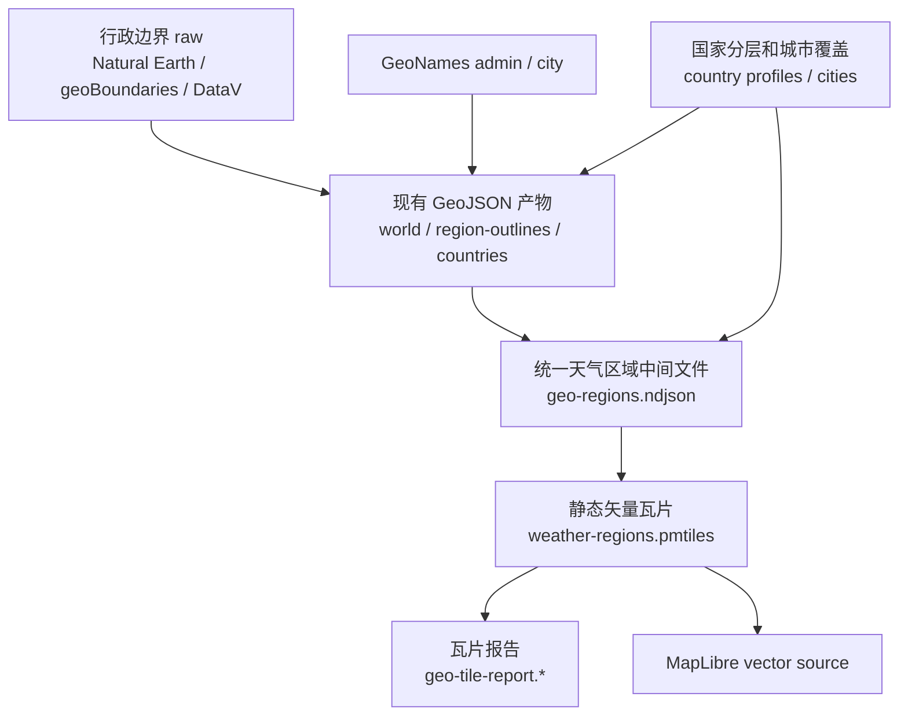

# 地图边界瓦片化性能优化方案

## 文档边界

本文定义把现有行政边界发布为静态矢量瓦片的性能优化方案。天气覆盖策略、C1/C2/C3 分层、城市选择和区域聚合口径仍以 `docs/specs/30-weather-coverage-design.md` 为准；数据来源和现有 GeoJSON 生成链路见 `docs/specs/31-data-flow.md`；地图 hover、点击和 marker 密度见 `docs/specs/41-weather-map-interactions.md`。

瓦片化只改变行政边界的发布和加载方式，不改变天气采样粒度，也不替代边界源清洗、GeoNames 对齐、国家分层复核和生成报告。

## 目标

地图边界资源从按业务视图拆分的大 GeoJSON 包，补充为按地图视口和缩放级别读取的静态矢量瓦片。浏览器只读取当前屏幕需要的瓦片片段，减少大范围地图打开和缩放时的边界传输、解析和渲染压力。

优化目标：

| 目标 | 说明 |
| --- | --- |
| 降低单次访问加载量 | 用户只读取当前视口和 zoom 需要的瓦片，不一次下载完整世界包或国家详情包 |
| 保持静态部署 | 瓦片在构建期生成，部署为静态文件，不引入请求时 API、数据库或动态瓦片服务 |
| 复用现有覆盖口径 | 继续使用现有 `regionKey`、C1/C2/C3 天气采样粒度和区域 summary |
| 简化运行时资产选择 | 地图挂载一个 vector source，通过 layer、filter 和 zoom 控制显示范围 |
| 支持灰度切换 | 保留现有 GeoJSON 路径，通过开关选择 GeoJSON 或 vector tiles 渲染 |

## 核心概念

| 概念 | 含义 |
| --- | --- |
| 行政边界源 | Natural Earth、geoBoundaries、DataV/高德等 raw 边界来源 |
| 天气区域 | 当前有天气聚合意义的 `regionKey` 区域，可以是 `country:*`、`admin1:*`、`admin2:*` 或 `boundary:*` |
| 矢量瓦片 | 按 `z/x/y` 切分的二进制地图数据，内部保存 polygon feature 和属性 |
| PMTiles | 把大量矢量瓦片打包成一个静态文件，浏览器通过 Range Request 按需读取 |
| source-layer | 瓦片内部的图层，例如 `weather_region`、`country`、`admin1`、`admin2` |
| display level | 前端当前用于填色的语义层级，由天气覆盖能力、zoom 和选中区域共同决定 |

瓦片不是新的边界来源。它是现有边界生成结果的发布格式。数据质量、行政口径和天气样本是否足够，仍由离线生成链路和覆盖规则决定。

## 加载模型

GeoJSON 模式按业务包加载：

```text
全球/大区
  -> /data/geo/world.geojson

选中 C3 国家
  -> /data/geo/countries/<country>.geojson

选中区域高亮
  -> /data/geo/region-outlines.geojson
```

矢量瓦片模式按地图视口加载：

```text
MapLibre 当前 center / zoom / viewport
  -> 计算屏幕覆盖到的 z/x/y
  -> 从 weather-regions.pmtiles 读取对应瓦片片段
  -> 按 feature.regionKey 匹配天气 summary
  -> 按当前 display level 和 filter 渲染填色与边界
```

PMTiles 文件本身可能大于单个 GeoJSON 包，但浏览器不会在首屏读取完整文件。用户不查看的地区和 zoom 层级不会被请求。性能收益来自按视口读取、二进制编码、低 zoom 简化和浏览器瓦片缓存。

## 数据组织

第一阶段生成的是天气区域瓦片，不是全球完整行政区全集。瓦片 feature 应只包含当前产品会展示或需要 hover 的区域。

```ts
type WeatherRegionTileFeature = {
  regionKey: string; // 例如 country:FR、admin1:CN.13、admin2:ES.51.01
  level: 'country' | 'admin1' | 'admin2' | 'boundary'; // feature 自身层级
  countryCode: string; // ISO A2
  admin1Code?: string; // 一级区域 code
  admin2Code?: string; // 二级区域 code
  labelZh?: string; // 中文展示名
  labelEn?: string; // 英文展示名
  minDisplayZoom?: number; // 该 feature 建议开始显示的 zoom
  weatherLevel: 'country' | 'admin1' | 'admin2'; // 当前天气聚合可用粒度
  hasWeatherRegion: boolean; // 是否能直接匹配区域 summary
}
```

`weatherLevel` 表达天气采样能力。瓦片可以包含更细边界，但填色层不能显示超过天气 summary 能支持的粒度。中国二级边界不可靠或没有对应天气 summary 时，高 zoom 继续使用一级区域填色，并叠加城市 marker。

## 生成链路

瓦片生成应接在现有边界生成后，不替代边界清洗逻辑。



建议新增中间文件：

```text
data/generated/geo-regions.ndjson
```

建议新增公开产物：

```text
apps/web/public/data/geo/weather-regions.pmtiles
```

建议新增报告：

```text
data/generated/geo-tile-report.json
data/generated/geo-tile-report.md
```

报告至少记录 feature 数、PMTiles 原始字节、压缩字节、各层级数量、缺失 summary 的 regionKey、每个 zoom 的瓦片数量和最大单瓦片大小。

## 显示规则

前端显示层级由三组条件共同决定：

| 条件 | 作用 |
| --- | --- |
| 天气覆盖能力 | C1 最多显示国家级填色，C2 最多显示一级区域，C3 才能显示二级区域 |
| 当前 zoom / 面积 | 区域在屏幕上足够大时才显示更细一层，避免小比例尺颜色破碎 |
| 当前选中区域 | 选中国家时只显示该国可用天气区域；选中一级区域时只显示其下可用子区域或继续显示一级区域 |

同一个父区域内部不要混合父级和子级填色。中国如果只可靠到一级区域，在高 zoom 时仍显示 `admin1:CN.*` 填色；城市 marker 用来解释样本位置。

## 前端开关

瓦片模式应通过公开环境变量启用，默认保留 GeoJSON。

```text
PUBLIC_GEO_RENDER_MODE=geojson
PUBLIC_GEO_VECTOR_URL=/data/geo/weather-regions.pmtiles
```

渲染模式：

| 模式 | 行为 |
| --- | --- |
| `geojson` | 使用现有 `world.geojson`、`region-outlines.geojson` 和 `countries/*.geojson` |
| `vector` | 注册 PMTiles protocol，添加 MapLibre vector source，通过 layer/filter 渲染天气区域 |

前端迁移时保留旧模块，新模块并行实现：

```text
apps/web/src/components/WorldWeatherMap/mapGeojson.ts       # 现有 GeoJSON 路径
apps/web/src/components/WorldWeatherMap/mapVectorTiles.ts   # 矢量瓦片路径
apps/web/src/components/WorldWeatherMap/mapRegionMode.ts    # 渲染模式选择
```

颜色接入可以先使用 `match` expression，把 `regionKey -> color` 写入图层样式；稳定后再评估 MapLibre `feature-state`。如果使用 `feature-state`，瓦片 feature 必须有稳定 id，且跨瓦片切片后的同一区域碎片共享同一状态键。

## 适用性判断

瓦片化适合在边界规模继续增长、国家详情包变多、移动端解析 GeoJSON 变慢或地图交互明显卡顿时推进。当前 GeoJSON Brotli 后体积仍可控，瓦片化短期会增加生成流程和前端双轨复杂度。

| 维度 | GeoJSON 模式 | 矢量瓦片模式 |
| --- | --- | --- |
| 构建复杂度 | 已有链路 | 需要额外生成中间文件和 PMTiles |
| 首屏加载 | 加载当前业务包 | 只加载当前视口瓦片 |
| 前端资产选择 | 需要 world / outline / country 包切换 | 一个 vector source 加 layer/filter |
| 数据清洗 | 已存在且必须保留 | 仍然必须保留 |
| 静态部署 | 支持 | 支持 |
| 大规模扩展 | 国家详情包会继续增加 | 更适合更多区域和更高 zoom |

## 落地检查

- GeoJSON 模式和 vector 模式可以通过环境变量切换，默认不改变线上行为
- `weather-regions.pmtiles` 只包含现有天气覆盖能支撑的填色区域，不强行生成全球完整 admin2
- 每个可填色 feature 都有稳定 `regionKey`，并能匹配当前区域 summary 或明确进入无数据样式
- 同一父区域内部只显示一个填色层级，不同时显示父级聚合色和子级聚合色
- C1/C2/C3 仍然只表达天气覆盖能力，瓦片模式不绕过城市采样和区域聚合规则
- PMTiles 支持静态托管和 Range Request，线上缓存头与公开数据刷新频率一致
- 报告记录体积、瓦片数量、最大瓦片大小、缺失 summary 和各层级 feature 数
- Playwright 验证 GeoJSON / vector 两种模式下地图非空、颜色正确、hover 可用、选中国家后过滤正确
