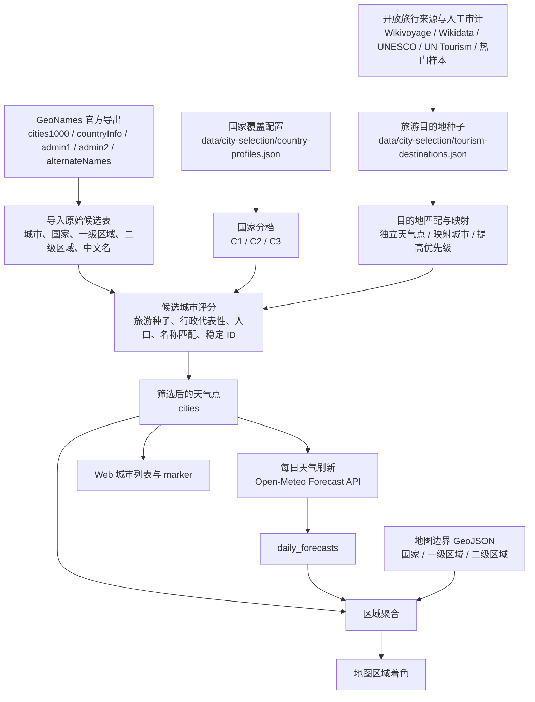

# 天气覆盖设计：国家分层、城市选择与地图着色

## 目标

Weather Trip 的核心任务是让用户比较旅行目的地天气。这个目标拆成两件事：

| 对象 | 作用 |
| --- | --- |
| 天气点 | 决定哪些城市或代表地点每天刷新天气，并参与列表、marker 和区域聚合 |
| 地图着色面积 | 决定天气颜色落在国家、一级区域还是二级区域上 |

原始城市和行政区数据适合做候选池和审计来源，不适合全部刷新天气、全部展示在地图上，也不适合让每个国家都展开到同一层级。

按 2026-07-23 的 [GeoNames](https://www.geonames.org/) 官方导出统计，[`cities1000.zip`](https://download.geonames.org/export/dump/cities1000.zip) 有 **170,486 个城市候选**，全球有 **3,865 个[一级行政区](https://download.geonames.org/export/dump/admin1CodesASCII.txt)** 和 **47,549 个[二级行政区](https://download.geonames.org/export/dump/admin2Codes.txt)**。

刷新所有城市时，14 天预报会超过 238 万条 city-date 缓存。即使只给每个二级行政区抽一个天气点，也会接近 5 万个天气点，带来天气刷新、缓存、区域聚合、地图渲染和移动端交互的性能压力。

很多二级区域对旅行天气比较的边际价值也不高。天气覆盖要保留足够的空间差异，同时把数据量控制在产品和刷新链路能稳定承担的范围内。

## 基础概念

| 概念 | 含义 |
| --- | --- |
| 天气点 | 系统每天刷新天气并在页面展示的城市或代表地点 |
| 区域 | 地图上被着色的面，可以是国家、一级区域或二级区域 |
| 三档国家 | 国家按覆盖深度分为 C1、C2、C3 |
| 两档体验 | 产品按全球/大洲和国家两种地图工作区组织 |
| GeoNames | 公开地名数据库，提供城市、坐标、人口、时区、国家代码和行政区代码等基础候选数据 |

项目不会把 GeoNames 当作产品展示全集。GeoNames 原始数据进入数据库后，只作为候选池；真正每天刷新天气并展示给用户的是筛选后的天气点。

## 三档国家

国家覆盖深度分为三档。`C` 表示 coverage，数字从粗到细排列；C1/C2/C3 只是覆盖深度代码，不代表国家重要性排序。

| 档位 | 名称 | 覆盖含义 |
| --- | --- | --- |
| C1 | 全国级国家 | 默认档位，不做行政区兜底 |
| C2 | 省州级国家 | 每个一级区域至少需要一个天气点 |
| C3 | 地市级国家 | 每个二级区域至少需要一个天气点 |

C2 和 C3 分别对应 GeoNames admin1 和 admin2。不同国家的真实行政区名称不同，所以文档统一用“一级区域”和“二级区域”描述地图与数据层级。

## 两档产品体验

产品体验分为全球/大洲和国家两档。两档都要同时定义城市显示和地图着色。

城市显示由天气点决定，地图着色由区域面积决定。两者可以不同：同一视图里可以显示所有城市点，但区域颜色按更粗的国家或一级区域聚合。

| 体验档位 | 城市显示和天气点 | 地图着色 |
| --- | --- | --- |
| 全球/大洲 | 使用所选全球或大洲范围内所有 `cities` 参与列表、marker 和区域聚合 | C1 国家按国家整体；C2 / C3 国家按一级区域 |
| 国家 | 使用该国家所有 `cities` 参与列表、marker 和区域聚合 | C1 国家按国家整体；C2 国家按一级区域；C3 国家按二级区域 |

两档体验都使用范围内全部 `cities`，原因是最终天气点规模预计约 3,400-3,600，列表、marker 和聚合可以承受。地图可以做 marker 避让，但不按入选原因排除天气点。

全球/大洲视图中的一级区域叠加层主要用于概览，不把用户直接带到某个省州筛选。用户可以从地图或下拉进入国家详情，再在国家工作区选择一级或二级区域。

## 国家分档规则

三档国家的分法来自两个判断：国家内部天气差异是否值得展开，以及展开到某一级行政区后数据量是否可控。

不同国家的行政区数量差异很大，统一抽到同一层级会让一些国家过粗，也会让另一些国家过细。中国的 GeoNames admin2 更接近地级行政区，数量约 360；美国的 GeoNames admin2 基本对应 county / county-equivalent，包括 county、parish、borough、census area、independent city 等，全国合计超过 3,000。

| 国家 | 一级行政区 | 二级行政区 | 设计判断 |
| --- | ---: | ---: | --- |
| 中国 CN | 31 | 360 | 二级区域约 300 多，且接近地级旅行天气范围，适合国家页下钻 |
| 美国 US | 51 | 3,143 | 二级区域基本是 county / county-equivalent，全国默认展开过细 |
| 俄罗斯 RU | 83 | 2,648 | 面积巨大，至少需要一级区域；二级区域过多 |
| 巴西 BR | 27 | 5,570 | 二级区域极多，国家页先按一级区域 |
| 加拿大 CA | 13 | 1,641 | 二级区域过多，省/地区级先足够 |
| 墨西哥 MX | 32 | 2,471 | municipality 级太多，州级先足够 |
| 日本 JP | 47 | 1,190 | 市町村级偏细，都道府县级先足够 |
| 西班牙 ES | 19 | 52 | 二级区域数量小，国家页适合下钻 |
| 法国 FR | 13 | 96 | departement 数量可控，适合国家页下钻 |
| 瑞士 CH | 26 | 149 | 海拔差异强，二级区域数量可控 |

### C1 国家

C1 是默认档位。没有进入 C2 或 C3 的国家都按 C1 处理。

C1 适合长尾国家、小国、城市国家、岛国和暂不深挖的中等国家。它们可以有多个天气点，但没有行政区兜底要求；覆盖重点放在首都、热门城市、人口代表城市和人工确认的旅游目的地。

### C2 国家

C2 适合两类国家：

1. 面积大，内部气候、海拔、纬度或东西跨度会让国家级颜色明显失真
2. 热门旅行国家，但二级区域数量过多或语义过细，国家页按一级区域已经足够

C2 国家列表来自三组判断：

| 入选类型 | 判断标准 |
| --- | --- |
| 大面积国家 | 国土面积大，东西或南北跨度明显，国家级颜色会抹平气候和海拔差异 |
| 热门旅行国家 | 用户会进入国家页比较区域天气，但二级区域数量过多或语义过细 |
| C3 不合适国家 | 二级区域达到数百到数千个，或二级区域更像 county / municipality 这类过细行政单元 |

| 代码 | 国家 | 入选理由 |
| --- | --- | --- |
| US | United States | 州级足以表达主要气候和旅行区域；二级区域约 3,143 个 county / county-equivalent，默认全国展开过细 |
| JP | Japan | 都道府县级足以表达旅行天气差异；二级区域约 1,190，默认全国展开偏细 |
| MX | Mexico | 州级先足够；二级区域约 2,471，municipality 级太多 |
| TH | Thailand | 府级适合国家详情；二级区域约 928，数量偏大 |
| TR | Turkiye | 省级适合国家详情；二级区域约 974，数量偏大 |
| DE | Germany | 一级区域足够表达主要空间差异；GeoNames 二级区域数量和语义不适合作为默认国家详情层 |
| CA | Canada | 省/地区级足以表达主要气候差异；二级区域约 1,641，默认全国展开过重 |
| AU | Australia | 州/领地级适合全国天气概览；二级区域约 540，中等偏大 |
| RU | Russia | 面积最大，东西和南北跨度极大，至少需要 C2 覆盖 |
| BR | Brazil | 面积大，亚马逊、东北、东南、南部差异明显 |
| IN | India | 面积和人口都大，季风、山地、沙漠和海岸差异强 |
| AR | Argentina | 南北跨度大，安第斯、潘帕斯、巴塔哥尼亚差异明显 |
| KZ | Kazakhstan | 面积大，草原、山地、荒漠差异明显 |
| DZ | Algeria | 地中海沿岸与撒哈拉差异明显 |
| CD | Democratic Republic of the Congo | 面积大，热带和高原差异明显 |
| SA | Saudi Arabia | 红海沿岸、内陆高原和沙漠差异明显 |
| ID | Indonesia | 岛屿国家，跨纬度和海洋影响明显，先按一级区域表达 |

Norway、Sweden、Egypt、Vietnam、Malaysia、Morocco、Pakistan、Ethiopia 可以作为 C2 观察池。它们有明显地理或旅行天气差异，但是否进入 C2 应结合导入报告、用户使用数据和边界资产成本再决定。

### C3 国家

C3 适合二级区域数量可控、且二级区域语义接近旅行天气区域的国家。

C3 国家列表来自三组判断：

| 入选类型 | 判断标准 |
| --- | --- |
| 二级区域数量可控 | 全国二级区域大致在几十到两百左右；中国约 360，但语义接近地级旅行区域 |
| 二级区域有旅行意义 | 二级区域能表达山地、海岸、岛屿、内陆、高原、城市群等天气差异 |
| 国家页需要明显下钻 | 进入国家页后，二级区域比一级区域提供更有用的天气比较粒度 |

| 代码 | 国家 | GeoNames 二级区域数 | 入选理由 |
| --- | --- | ---: | --- |
| CN | China | 约 360 | 地级市、自治州、地区、盟和直辖市语义接近旅行天气区域；数量可控 |
| ES | Spain | 52 | 省、岛屿和南北海岸差异明显，数量小 |
| FR | France | 96 | departement 数量可控，山地、海岸、海外地区和城市群差异明显 |
| IT | Italy | 107 | 南北、阿尔卑斯、亚平宁和岛屿差异明显 |
| GB | United Kingdom | 185 | 英格兰、苏格兰、威尔士、北爱内部差异有价值，数量可控 |
| GR | Greece | 54 | 岛屿、大陆和山地差异明显 |
| AT | Austria | 94 | 阿尔卑斯海拔差异强，数量可控 |
| CH | Switzerland | 149 | 海拔差异是核心天气变量，数量可控 |
| NZ | New Zealand | 66 | 南北岛、山地、海岸差异明显 |
| CL | Chile | 56 | 南北跨度极大，沙漠、地中海、巴塔哥尼亚差异强 |
| ZA | South Africa | 52 | 海岸、内陆高原、开普区域差异明显 |
| PE | Peru | 196 | 海岸、安第斯和雨林差异明显，数量仍可控 |

C3 国家合计约 1,467 个二级区域。实际天气点会和一级区域、人口兜底、旅游种子城市重合一部分。

C3 国家需要重点检查 GeoNames admin2 的语义质量。导入报告要暴露缺失区域、重复映射、异常名称、边界无法匹配区域和代表点过弱区域，避免把不稳定的二级区域直接变成国家页默认体验。

## 城市选择流程

城市选择从国家分档开始。先决定国家属于 C1/C2/C3，再按对应深度选择天气点。

城市和行政区候选来自 GeoNames 官方导出：[`cities1000.zip`](https://download.geonames.org/export/dump/cities1000.zip)、[`countryInfo.txt`](https://download.geonames.org/export/dump/countryInfo.txt)、[`admin1CodesASCII.txt`](https://download.geonames.org/export/dump/admin1CodesASCII.txt)、[`admin2Codes.txt`](https://download.geonames.org/export/dump/admin2Codes.txt)、[`alternateNamesV2.zip`](https://download.geonames.org/export/dump/alternateNamesV2.zip)。天气刷新使用 [Open-Meteo Forecast API](https://open-meteo.com/en/docs)。



GeoNames 原始表只保存来源字段和必要的内部主键。`geoname_id`、`admin1_code`、`admin2_code`、`feature_code`、`population` 等字段保持 GeoNames 原始语义。

国家分档、人口兜底、旅游权重和种子映射保存到仓库内 JSON，便于 review、diff 和复跑。导入脚本读取这些文件，输出筛选后的 `cities`；每日天气刷新只读取 `cities`。

```text
data/
└── city-selection/
    ├── country-profiles.json           # 国家分档、旅游权重和补充配额
    ├── tourism-destinations.json       # 人工确认的旅游目的地种子
    ├── source-wikivoyage.json          # 离线脚本生成的开放旅行种子
    ├── source-unesco-nearby.json       # 遗产点附近城市种子
    └── source-un-tourism-villages.json # 小村镇种子
```

旅游目的地种子和最终天气点保持分离。种子描述用户可能关心的目的地，天气点描述系统实际刷新天气的坐标。

一个目的地可以独立成为天气点，也可以映射到附近城市，或只提高已有城市的入选优先级。

| 种子模式 | 处理 |
| --- | --- |
| `standalone` | 尝试作为独立天气点进入 `cities` |
| `map_to_nearest_city` | 映射到附近城市，不直接增加天气点 |
| `boost_existing_city` | 提高已有城市入选优先级 |

### 入选来源

| 来源 | 说明 | 来源链接 |
| --- | --- | --- |
| GeoNames 导入城市池 | 从 `cities1000.zip` 经过 feature class、坐标、时区和国家代码过滤后的基础池 | [`cities1000.zip`](https://download.geonames.org/export/dump/cities1000.zip) |
| GeoNames 国家和洲别 | 提供国家代码、国家名称和洲别 | [`countryInfo.txt`](https://download.geonames.org/export/dump/countryInfo.txt) |
| GeoNames 一级区域 | 提供一级行政区原始代码、英文名和 GeoNames ID | [`admin1CodesASCII.txt`](https://download.geonames.org/export/dump/admin1CodesASCII.txt) |
| GeoNames 二级区域 | 提供二级行政区原始代码、英文名和 GeoNames ID | [`admin2Codes.txt`](https://download.geonames.org/export/dump/admin2Codes.txt) |
| GeoNames alternate names | 提供城市和行政区中文名；只落系统需要的中文语言码 | [`alternateNamesV2.zip`](https://download.geonames.org/export/dump/alternateNamesV2.zip) |
| 国家覆盖配置 | 定义 C1/C2/C3、人口兜底、旅游权重和重点国家覆盖深度 | 仓库内 `data/city-selection/country-profiles.json` |
| 旅游目的地种子 | 人工确认的热门旅游目的地、岛屿、山地门户、小目的地映射 | 仓库内 `data/city-selection/tourism-destinations.json` |
| GeoNames capitals | `feature_code = 'PPLC'` 的国家/地区首都，全部保留 | 来自 GeoNames 导入城市池 |
| Population fallback | 按国家配置配额选出的人口代表城市 | 来自 GeoNames 导入城市池和国家覆盖配置 |
| 一级区域代表点 | C2 / C3 国家的一级区域代表点 | 来自 GeoNames 城市池和一级区域 |
| 二级区域代表点 | C3 国家的二级区域代表点 | 来自 GeoNames 城市池和二级区域 |

只按 `PPLC`、`PPLA`、`PPLA2`、百万人口 `PPL`、每国人口前三和每个一级区域人口前三全量纳入，会选出大量普通行政中心。这个数量超过天气刷新和前端展示需要，也不等于用户会主动比较天气的旅行目的地。

`PPLA2` 不作为全量入选理由，只作为排序和候选特征参与评分。

### C1 国家城市选择

C1 国家不按行政区做兜底，只保留少量真正有用的天气点：

| 天气点类型 | 作用 |
| --- | --- |
| 首都 | 保证长尾国家最低可见性 |
| 人口代表城市 | 保证主要城市天气可比较 |
| 旅游种子 | 保证热门旅行目的地、小岛、山地门户和国家公园门户不被人口规则漏掉 |
| 映射点 | 将区域、景区、主题公园或小村映射到附近更适合展示的城市 |

### C2 国家城市选择

C2 国家每个 GeoNames admin1 至少选一个代表天气点。一级区域代表点和首都、人口兜底、旅游种子一起进入候选评分，避免只为了行政覆盖选出普通城镇。

一级区域代表点是最低覆盖要求。面积巨大、海拔差异强、旅游目的地分散的一级区域，可以保留多个天气点；地图着色仍按该一级区域聚合。

若某个一级区域在 `cities1000` 候选池里没有人口大于 0 且坐标、时区完整的城市，则该区域进入导入报告 review。

### C3 国家城市选择

C3 国家每个 GeoNames admin2 至少选一个代表天气点。二级区域代表点和旅游种子共同决定国家页的细粒度天气覆盖。

二级区域代表点也是最低覆盖要求。中国西部、秘鲁安第斯、智利南北跨度区域、瑞士和奥地利阿尔卑斯区域这类天气差异强的地方，可以通过旅游种子保留多个天气点。

若某个二级区域没有合适城市，则进入导入报告 review。review 后可以映射到附近城市、补充手工天气点，或确认该区域不着色。

### 中国覆盖口径

中国不使用“每省人口前 20”。这个规则会把 Luohu District、Majie、Longling County 这类城市内部片区、区县或非主要旅行代表点选进来，造成和深圳、昆明、保山等城市重复。

中国按地级行政区选择代表天气点，范围包括地级市、地区、自治州、盟，并把北京、上海、天津、重庆四个直辖市作为必选代表点。

这个口径参考民政部行政区划层级，并用 GeoNames admin2 数据落库匹配。代表点优先使用人工旅游种子，其次看行政代表性和人口。

云南代表点应包含 Dali、Lijiang、Jinghong、Shangri-La、Mangshi、Kunming、Qujing、Baoshan、Zhaotong、Mengzi、Chuxiong、Wenshan City、Lincang、Pu'er、Lushui、Yuxi 这类覆盖省内主要旅行气候差异的城市。

Dali、Lijiang、Jinghong、Shangri-La、Mangshi 写入旅游目的地种子，避免后续被人口配额挤掉。

### 代表点选择

每个行政分区只选一个默认代表天气点。排序规则：

1. 命中旅游目的地种子的目的地优先
2. 城市名与行政区名首词相同或接近优先
3. 行政中心 feature code 优先
4. 人口高优先
5. GeoNames ID 稳定排序兜底

一级区域和二级区域代表点都使用这个排序思想，不为了行政覆盖强行选县城、区县或普通城镇。

若某个区域在 `cities1000` 候选池里没有人口大于 0 且坐标、时区完整的城市，则该区域进入导入报告 review，不硬造天气点。

### 小目的地策略

小旅行点只有在用户会单独比较其天气时才进入独立天气城市。天气工具要展示用户会选择住在哪里、抵达哪里、天气差异是否明显的代表点。

天气接口按经纬度请求未来天气，不要求城市有专门气象站。[Open-Meteo Forecast API](https://open-meteo.com/en/docs) 会为给定位置自动选择适用的天气模型。

小目的地是否进入页面，取决于它是否值得作为独立天气比较对象，以及它的天气是否和附近代表城市有明显差异。

| 目的地类型 | 处理方式 |
| --- | --- |
| 小岛、孤立岛屿国家、远离大陆的海岛 | 保留独立天气点，优先用岛上主要城镇或首府坐标 |
| 高海拔小镇、滑雪村、山地门户 | 天气与附近大城市差异明显时保留独立天气点 |
| 国家公园门户村镇 | 如果用户通常住在门户镇且气候不同，保留门户镇；否则映射到最近服务城市 |
| 古镇、遗产村、普通景区村 | 默认作为旅游目的地种子影响附近城市入选，不单独占天气点 |
| 大城市内城区、区县、卫星城 | 默认合并到主城市，避免重复天气点 |
| 小国家或城市国家 | 保留首都或主要城市，不按人口过滤掉 |

独立天气点的默认判断：

| 条件 | 处理 |
| --- | --- |
| 距离映射城市少于 30 公里，海拔差少于 300 米，且没有岛屿/山地/海岸微气候特征 | 映射到已有城市 |
| 距离映射城市超过 50 公里，或海拔差超过 500 米 | 倾向保留独立天气点 |
| 岛屿、半岛末端、沙漠绿洲、峡谷、高山、滑雪区、国家公园深处 | 即使人口很小，也可以保留独立天气点 |
| 只是大城市内热门街区、景点、公园、博物馆 | 合并到主城市 |
| 小国家只有一个主要住宿/抵达城市 | 保留该主要城市，其他小点映射到它 |

如果目的地不在 GeoNames `cities1000` 中，但满足独立天气点条件，可以扩展一张手工天气点表，保存稳定 ID、名称、国家、坐标、时区和来源。

### 交叉审计

筛选结果需要和 [Wikivoyage](https://www.wikivoyage.org/)、[Wikidata](https://www.wikidata.org/wiki/Wikidata:Data_access)、[UNESCO World Heritage List](https://whc.unesco.org/en/list/)、[UN Tourism Best Tourism Villages](https://tourism-villages.unwto.org/) 以及人工热门样本做交叉审计。审计用于发现明显漏掉的高价值目的地；这些来源不会全量进入天气点。

| 审计来源 | 处理结论 |
| --- | --- |
| Wikivoyage `Category:Star cities` | 多数是很小的目的地或非城市标题，不全收，用于发现高价值漏项 |
| Wikivoyage `Category:Guide cities` | 作为后续离线种子来源，不直接全量进入天气点 |
| Wikivoyage `Category:Huge city articles` | 大城市命中率高，剩余通常是标题映射问题 |
| 人工热门样本 | 用于补充岛屿、山地、海岸和度假目的地 |

审计后应把明确漏项写入旅游目的地种子，例如 Santorini 映射 Fira，Crete 映射 Heraklion / Chania，Walt Disney World 映射 Orlando。

Wikivoyage 审计是名称级近似匹配，不能直接等同于真实缺失。岛屿、景区、主题公园、区域标题经常应该映射到附近城市天气点，避免一比一膨胀成新城市。

### SPARQL 使用边界

[Wikidata SPARQL](https://query.wikidata.org/) 有价值，但不适合做运行时依赖，也不适合一次性写很重的全球大查询。

本地计时样本：

| 查询 | 结果 |
| --- | --- |
| Wikivoyage sitelink 简单抽样 `LIMIT 100` | 约 0.7 秒 |
| Wikivoyage + `wdt:P31 wd:Q515` + 国家/人口/坐标 `LIMIT 100` | 约 7.4 秒 |
| Wikivoyage + `P31/P279*` 城市层级推理 | 超过 60 秒未返回 |

推荐做法是离线脚本小步查询或直接用 Wikidata/Wikivoyage dump 处理，生成本地种子文件。导入脚本读取本地种子文件，不在每日天气刷新链路中调用 SPARQL。

## 地图着色规则

地图区域着色表达所选天气指标在空间上的差异。面状颜色来自天气点聚合，不使用行政区几何面积平均，也不做邻近插值。

| 场景 | 着色规则 |
| --- | --- |
| 全球 | C1 国家按国家整体；C2 / C3 国家按一级区域 |
| 大洲 | 与全球相同，只限制在所选大洲范围 |
| C1 国家页 | 国家整体 |
| C2 国家页 | 一级区域 |
| C3 国家页 | 二级区域 |

中国、美国、加拿大、澳大利亚、俄罗斯等 C2 / C3 国家在全球/大洲按一级区域着色，避免一个国家色块抹平内部差异。

中国、西班牙、法国、意大利、英国、瑞士、智利、秘鲁等 C3 国家，在国家页显示更细的二级区域色块。

一个区域没有样本时不着色，不用相邻区域、国家平均或几何中心天气推断。区域 tooltip 和图例必须让用户知道颜色来自样本聚合。

区域 tooltip 至少展示样本数、代表天气点和聚合方式。样本数为 1 的区域要明确显示代表点名称，避免用户把区域颜色理解成整个行政区的面积平均天气。

| 指标 | 聚合方式 |
| --- | --- |
| weather | 样本中出现次数最多的天气类型 |
| temperature | 样本平均温度 |
| humidity | 样本平均相对湿度 |
| precipitation | 样本平均降水 |
| wind | 样本平均最大风速 |
| elevation | 样本城市平均海拔 |
| comfort | 单日舒适度平均，City Finder 使用匹配天数比例 |

### 地图图层与选择

地图需要支持国家层、一级区域层和二级区域层同时或按需存在：

| 图层 | 用途 |
| --- | --- |
| 国家面 | C1 国家底色和国家边界 |
| 一级区域面 | 全球/大洲的一级区域叠加；C2 国家详情 |
| 二级区域面 | C3 国家详情，按国家或子地区懒加载 |
| 城市点 | 城市/代表点天气样本和 forecast 入口 |

图层优先级：

1. 二级区域面覆盖一级区域面
2. 一级区域面覆盖国家面
3. 城市点始终在区域面上方

筛选控件按两档体验组织：

| 场景 | 控件 |
| --- | --- |
| 全球/大洲 | 主地区选择全球或大洲；地图显示一级区域概览，但不把世界变成行政区筛选器 |
| 国家 | 主地区选择国家；下方显示该国一级/二级区域选择 |

全球或大洲下，子地区控件不作为筛选项展示。用户可以从地图或下拉进入详细国家，再在国家工作区选择一级/二级区域。

| 当前视图 | 点击对象 | 行为 |
| --- | --- | --- |
| 全球/大洲 | C1 国家 | 保持当前 region 或显示 tooltip，不进入细分 |
| 全球/大洲 | C2 / C3 国家或其一级区域面 | 进入该国家详情 |
| C2 国家 | 一级区域面 | 进入该一级区域 |
| C3 国家 | 二级区域面 | 进入该二级区域 |
| 任意视图 | 城市 marker | 选中城市 forecast，不改变 region |

### 视野与视觉

切换地区时，地图优先使用目标区域的边界计算 bounds；只有没有边界或没有区域 summary 时，才退回城市点 bounds。

跨 180 度经线使用最短经度区间，避免阿拉斯加、太平洋岛国等区域把视野扩到接近全球。

天气图层、筛选条件和日期变化不强制重置视野，避免用户正在查看的地图位置跳动。

| 场景 | 视觉规则 |
| --- | --- |
| 全球/大洲 | 国家边界清楚，一级区域边界更弱；详细国家内部可见色块但不喧宾夺主 |
| 国家详情 | 覆盖层级是主视觉，边界线比全球更清楚 |
| 二级区域详情 | 面数量较多时降低边界线透明度，marker 和 hover 高亮帮助定位 |
| 无样本区域 | 不填色或低透明空态，不用国家平均色填补 |
| 海拔层 | 图例强调“样本海拔平均”，避免用户理解成行政区域真实面积平均海拔 |

### 边界资产

代表点进入 `cities` 只解决天气数据。地图按一级/二级区域面着色还需要对应 GeoJSON 边界。

```text
apps/web/public/data/geo/
├── world-countries.geojson
├── detailed-admin1.geojson
└── detailed-admin2/
    ├── CN.geojson
    ├── ES.geojson
    ├── FR.geojson
    └── ...
```

边界标准化规则：

| 来源属性 | 目标 |
| --- | --- |
| ISO 3166-1 alpha-2 | 国家代码 |
| GeoNames admin1 code 或可稳定映射字段 | 一级区域标识 |
| GeoNames admin2 code 或可稳定映射字段 | 二级区域标识 |
| 中文/英文名称 | 只作展示，不作 key 匹配真源 |

中国省级 adcode、地级 adcode 和 GeoNames code 的关系只放在地图适配层，不写回 `geo_names_cities`、`geo_names_admin1` 或 `geo_names_admin2` 原始表。

## 规模与刷新

目标规模由 C1 代表城市、C2 一级区域代表点、C3 二级区域代表点和旅游种子共同组成：

| 来源 | 目标规模 | 说明 |
| --- | ---: | --- |
| C3 国家二级区域 | 约 1,467 | CN、ES、FR、IT、GB、GR、AT、CH、NZ、CL、ZA、PE |
| C2 国家一级区域 | 约 648 | US、JP、MX、TH、TR、DE、CA、AU、RU、BR、IN、AR、KZ、DZ、CD、SA、ID |
| C1 代表城市、人口兜底和旅游种子 | 约 1,300-1,500 | 包含首都、热门城市、人口代表点、小目的地映射点和人工旅游种子 |

预计最终天气城市数约 3,400-3,600。不同来源会有重合，例如同一城市可能同时是旅游种子、人口兜底和行政区代表点。

按 14 天预报计算，目标缓存约 47,600-50,400 行；按 batch size 40，完整刷新约 85-90 次 Open-Meteo 请求。这个规模可以稳定支撑每日刷新，也能避开全量二级区域带来的缓存、聚合、地图渲染和移动端交互压力。

主要风险集中在边界 GeoJSON 文件大小和移动端渲染，而非天气点数量。二级区域边界需要做简化、按国家拆包、缓存和加载状态。

### 天气接口边界

系统使用 [Open-Meteo Forecast API](https://open-meteo.com/en/docs) 按经纬度请求天气，支持一次请求传入多个纬度/经度，并用 `timezone=auto` 自动返回对应时区天气。每日天气刷新按批处理天气点，刷新未来 14 天的每日天气。

Open-Meteo 返回的 `daily.time` 表示地点当地自然日，而非 UTC 时间戳。因为请求使用 `timezone=auto`，中国城市按 `Asia/Shanghai` 日期理解，美国、日本、欧洲等城市按各自地点时区日期理解。

天气缓存日期也按这个 date-only 语义保存。读取和比较日期时不能把地点当地自然日转换成 UTC 日期，否则跨时区城市会出现日期前后偏移，导致缓存判断失真。

[Open-Meteo Geocoding API](https://open-meteo.com/en/docs/geocoding-api) 可以按名称搜索地点，并返回坐标、海拔、时区、人口等字段；它的地点数据来自 GeoNames。它适合做种子匹配校验和缺失坐标补全，不适合作为“热门旅游城市列表”的唯一来源，也不应该替代本项目自己的城市筛选真源。

按 Open-Meteo 免费 API 规模估算，刷新成本按 HTTP 请求数估算，不按 city-date 数估算：

| 城市数 | batch size | 空缓存或每日整批刷新请求数 |
| ---: | ---: | ---: |
| 2,000 | 40 | 50 |
| 3,000 | 40 | 75 |
| 3,600 | 40 | 90 |
| 5,000 | 40 | 125 |

每日天气刷新会检查每个城市在“当地今天前一天到未来第 14 天”这个容忍窗口内是否已有 14 条预报。这个窗口用于吸收 Open-Meteo `timezone=auto` 和全球时区边界带来的头尾日期差异。

某个城市不足 14 条时，刷新任务重新请求该城市的 14 天预报，并只写入容忍窗口内缺失的日期。

如果后续更换天气源，需要确认是否支持任意经纬度、是否要求供应商地点 ID、是否支持批量请求、可用预报天数、限额策略和是否有可用地点搜索接口。天气源能力影响刷新方式，不改变城市本身的旅行价值判断。

### 更新频率

城市筛选不属于每日天气刷新链路，不在运行时频繁访问 SPARQL、榜单页面或外部旅游站。

| 数据 | 节奏 |
| --- | --- |
| GeoNames 城市池 | 每月或每季度手动刷新一次，或者上线前刷新 |
| Wikivoyage / Wikidata 种子 | 每月或每季度离线刷新一次 |
| UN Tourism / UNESCO 种子 | 每季度或有明确数据更新时刷新 |
| 人工 curated 种子 | 发现明显漏项时随代码一起提交 |

每日天气刷新只读取数据库里的 `cities`，不重新研究城市列表。

GeoNames 导出目录提供 `modifications-YYYY-MM-DD.txt` 和 `deletes-YYYY-MM-DD.txt` 这类按日期的变更文件，因此可以按天做增量同步。

本项目没有必要把城市主数据做成每日自动任务。全量手动导入更简单，也能在每次修改筛选规则后同步重算 `cities`，避免过时选择残留。

## 落地检查

| 检查项 | 标准 |
| --- | --- |
| 国家覆盖配置 | C1/C2/C3 国家列表、详细覆盖层级和人口兜底与本文档一致 |
| 代表点 | C2 / C3 国家按目标层级至少有一个代表天气点 |
| 大区域覆盖 | 面积巨大、海拔差异强或旅游点分散的区域可以有多个天气点 |
| 城市字段 | 天气点能稳定关联 country、一级区域和二级区域 |
| 地图边界 | 一级/二级区域边界能稳定映射到 GeoNames admin code |
| 区域聚合 | 全球/大洲使用所有天气点，并按三档国家聚合着色 |
| 区域可信度 | tooltip 展示样本数、代表天气点和聚合方式 |
| 国家详情 | C2 国家按一级区域，C3 国家按二级区域聚合着色 |
| 导入报告 | 输出每个国家、每个档位、每类 reason 的数量、缺失 review、异常 admin2、边界无法匹配区域和代表点过弱区域 |

## 后续改进

1. 对美国、加拿大、日本、墨西哥等二级区域数量大的国家，后续可以做“进入一级区域后再懒加载二级区域”，不在全国详情一次性展开
2. 给 C3 国家补 curated 旅游种子，避免只靠行政中心和人口
3. 为边界文件建立简化等级，桌面和移动端使用不同精度
4. 对二级区域无合适城市的区域输出 review 列表，人工决定映射或跳过
5. 可以接入 [OpenWeather Weather Maps](https://openweathermap.org/api/weather-map-2) 做连续天气底图，和基于天气点聚合的区域着色分开呈现
